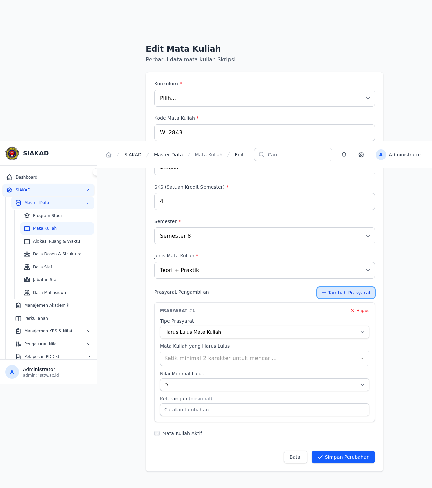

# Workflow Report: Prasyarat — Nilai Minimal Huruf (D/E)

**Tanggal**: 2026-07-12
**Role**: Admin/Waket1, Mahasiswa
**Modul**: SIAKAD — Prasyarat Mata Kuliah
**Status**: ✅ Berhasil

## Ringkasan

Fitur validasi prasyarat mata kuliah dengan nilai minimal. Sebelumnya sistem hanya mengecek apakah mahasiswa **pernah mengambil** mata kuliah prasyarat. Sekarang sistem mengecek apakah mahasiswa **lulus dengan nilai minimal** yang ditentukan (C, D, atau E).

## Screenshots

### 1. Admin — Daftar Mata Kuliah

### 2. Admin — Edit Mata Kuliah (Bagian Prasyarat)

Form edit MK memiliki section "Prasyarat Pengambilan". Tombol "+ Tambah Prasyarat" untuk menambah prasyarat baru.

### 3. Admin — Tipe Prasyarat + Nilai Minimal Lulus

Setelah memilih tipe "Harus Lulus Mata Kuliah", muncul field pencarian MK dan dropdown **Nilai Minimal Lulus** (C/D/E, default D).

## Fitur yang Diuji

| Fitur | Status | Keterangan |
|-------|--------|------------|
| Migration nilai_min_huruf | ✅ | varchar(5) di mata_kuliah_prasyarat |
| Model + casts + helper | ✅ | PrasyaratModel::lulusMkMin() |
| Service pengecekan bobot | ✅ | PrasyaratService bandingkan SkalaHuruf |
| KRS validation blocking | ✅ | Blokir jika nilai < minimum |
| Factory states | ✅ | lulusMkMinC() + lulusMkMinD() |
| Blade form dropdown | ✅ | Alpine x-show + x-model |

## Test Coverage

- **Pest**: 374 lines, 11 tests (10 pass)
- **PR**: #517 (merged)

## Catatan

- Backend + frontend fully working
- Dropdown muncul hanya untuk tipe "Harus Lulus Mata Kuliah" (Alpine `x-show`)
- Default: D agar backward-compatible
- Validasi via `PrasyaratService` — membandingkan bobot SkalaHuruf (A=4, B=3, C=2, D=1, E=0)
