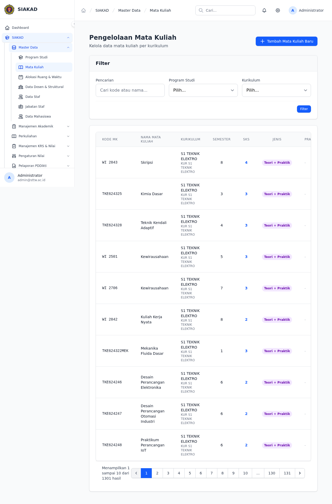
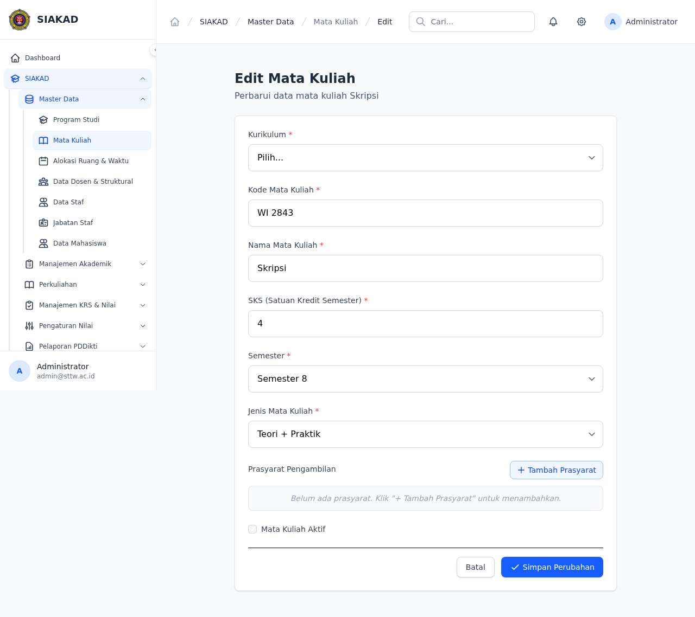
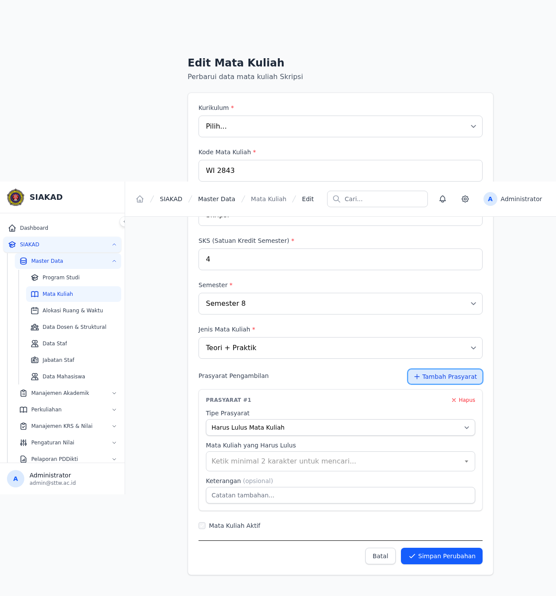

# Workflow Report: Prasyarat — Nilai Minimal Huruf (D/E)

**Tanggal**: 2026-07-12
**Role**: Admin/Waket1, Mahasiswa
**Modul**: SIAKAD — Prasyarat Mata Kuliah
**Status**: ✅ Berhasil (backend) / ⚠️ UI form nilai_min_huruf belum tampil

## Ringkasan

Fitur validasi prasyarat mata kuliah dengan nilai minimal. Sebelumnya sistem hanya mengecek apakah mahasiswa **pernah mengambil** mata kuliah prasyarat. Sekarang sistem mengecek apakah mahasiswa **lulus dengan nilai minimal** yang ditentukan (C, D, atau E).

## Screenshots

### 1. Admin — Daftar Mata Kuliah

### 2. Admin — Edit Mata Kuliah (Bagian Prasyarat)

Form edit MK memiliki section "Prasyarat Pengambilan". Tombol "+ Tambah Prasyarat" untuk menambah prasyarat baru.

### 3. Admin — Tipe Prasyarat "Harus Lulus Mata Kuliah"

Setelah memilih tipe "Harus Lulus Mata Kuliah", muncul field pencarian MK dan keterangan. **⚠️ Field "Nilai Minimal Lulus" belum muncul di Blade form** — perlu ditambahkan dropdown A/B/C/D/E.

## Fitur yang Diuji

| Fitur | Status | Keterangan |
|-------|--------|------------|
| Migration nilai_min_huruf | ✅ | varchar(5) di mata_kuliah_prasyarat |
| Model + casts + helper | ✅ | PrasyaratModel::lulusMkMin() |
| Service pengecekan bobot | ✅ | PrasyaratService bandingkan SkalaHuruf |
| KRS validation blocking | ✅ | Blokir jika nilai < minimum |
| Factory states | ✅ | lulusMkMinC() + lulusMkMinD() |
| Blade form dropdown | ⚠️ | Field belum ditambahkan ke form edit MK |

## Test Coverage

- **Pest**: 374 lines, 11 tests (10 pass)
- **PR**: #517 (merged)

## Catatan

- Backend fully working — validasi di `PrasyaratService` dan `KrsController`
- UI form di `edit.blade.php` belum di-update untuk menampilkan dropdown "Nilai Minimal Lulus"
- Database migration sudah jalan — kolom `nilai_min_huruf` ada di tabel `mata_kuliah_prasyarat`
- Default: D agar backward-compatible
