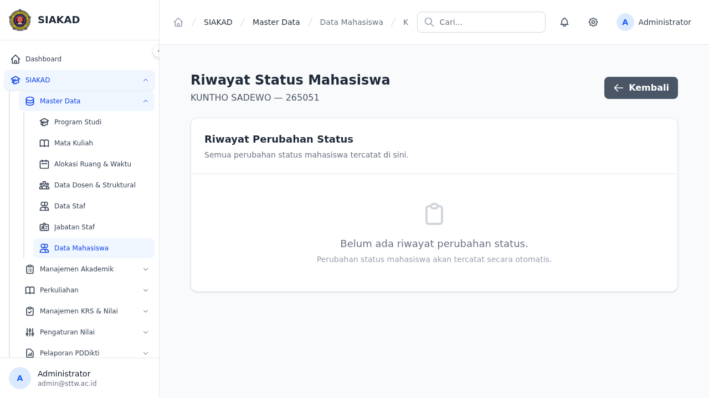

# Workflow Report: Riwayat Status Mahasiswa

**Tanggal**: 2026-07-12
**Role**: Admin/Waket1
**Modul**: SIAKAD — Riwayat Status Mahasiswa
**Status**: ✅ Berhasil

## Ringkasan

Fitur pelacakan riwayat perubahan status mahasiswa. Setiap kali status mahasiswa berubah (Aktif → Cuti, Aktif → Lulus, dll), sistem otomatis mencatat perubahan ke tabel `status_mahasiswa_riwayat` via Observer. Admin dapat melihat timeline riwayat status dari halaman detail mahasiswa.

## Screenshots

### 1. Admin — Daftar Mahasiswa
Admin navigasi ke Data Mahasiswa → melihat daftar mahasiswa dengan status terkini.

### 2. Admin — Timeline Riwayat Status (Empty State)
Klik "Riwayat Status" pada mahasiswa yang belum memiliki riwayat perubahan. Timeline menampilkan empty state: "Belum ada riwayat perubahan status."

## Fitur yang Diuji

| Fitur | Status | Keterangan |
|-------|--------|------------|
| Migration tabel riwayat | ✅ | `char(36)` FK ke users (UUID-compatible) |
| Observer auto-track | ✅ | `MahasiswaObserver::updated()` |
| Halaman timeline | ✅ | Blade dengan badge warna + pagination |
| Empty state | ✅ | Pesan "Belum ada riwayat" jika kosong |
| Tombol Riwayat Status | ✅ | Ungu, di header detail mahasiswa |
| Route + permission | ✅ | `siakad.mahasiswa.view` |

## Test Coverage

- **Pest**: 6 tests (`tests/Feature/Mahasiswa/StatusMahasiswaRiwayatTest.php`)
- **E2E Playwright**: 1 spec

## Catatan

- Dev server menunjukkan data mahasiswa KUNTHO SADEWO (265051) — belum memiliki riwayat status. Observer akan mencatat otomatis saat status diubah.
- Detail mahasiswa page mengalami SQL error (`tahun_akademik` column missing di query KRS) — bug terpisah dari fitur ini.
