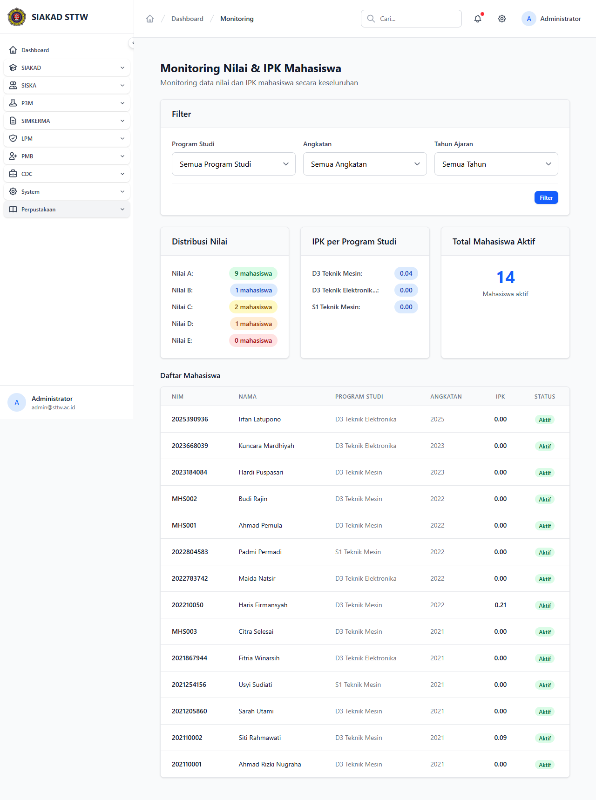

# Workflow Report: Monitoring Nilai & IPK — Bugfix Verification

**Tanggal**: 2026-05-12
**Role**: Administrator (admin@sttw.ac.id) — sebagai proxy Waket1
**Modul**: SIAKAD — Monitoring
**Fitur**: Monitoring IPK Per Prodi (`/siakad/monitoring`)
**Status**: ✅ Berhasil (bugfix verified)

## Deskripsi Workflow

Verifikasi **bugfix #138** — sebelumnya `/siakad/monitoring` melempar HTTP 500 karena query `ipkPerProdi` menggunakan agregasi yang incompatible dengan join chaining. Fix: `fix(siakad/monitoring): rewrite ipkPerProdi`. Workflow ini memastikan halaman load tanpa exception untuk role admin/waket1.

## Ringkasan

- HTTP 500 sebelum fix → kini load 200 OK dengan title "Monitoring Nilai & IPK".
- Render dashboard IPK per prodi tanpa SQL exception.

## Langkah-langkah

### 1. Halaman Monitoring — Fixed (200 OK)

**Deskripsi**: Akses `/siakad/monitoring` (via sidebar Monitoring atau direct). Halaman render dashboard IPK per prodi dengan card statistik. Title: "Monitoring Nilai & IPK".

**URL**: `http://127.0.0.1:8000/siakad/monitoring`

## Temuan & Masalah

| # | Halaman | URL | Kategori | Deskripsi | Screenshot | Prioritas |
|---|---------|-----|----------|-----------|------------|-----------|
| - | - | - | - | Tidak ada — bug #138 sudah resolved | - | - |

## Catatan

- Source fix: commit `fix(siakad/monitoring): rewrite ipkPerProdi` (referenced GitHub issue #138).
- Verifikasi dilakukan dengan role admin (memiliki permission monitoring); role asli yang menggunakan halaman ini adalah **Waket1**.
- Re-scan ini bagian dari **Phase 3 bugfix verification**.
