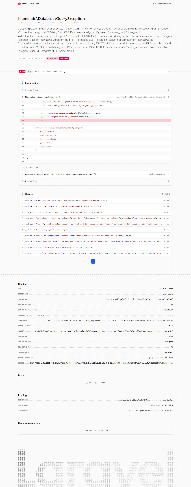
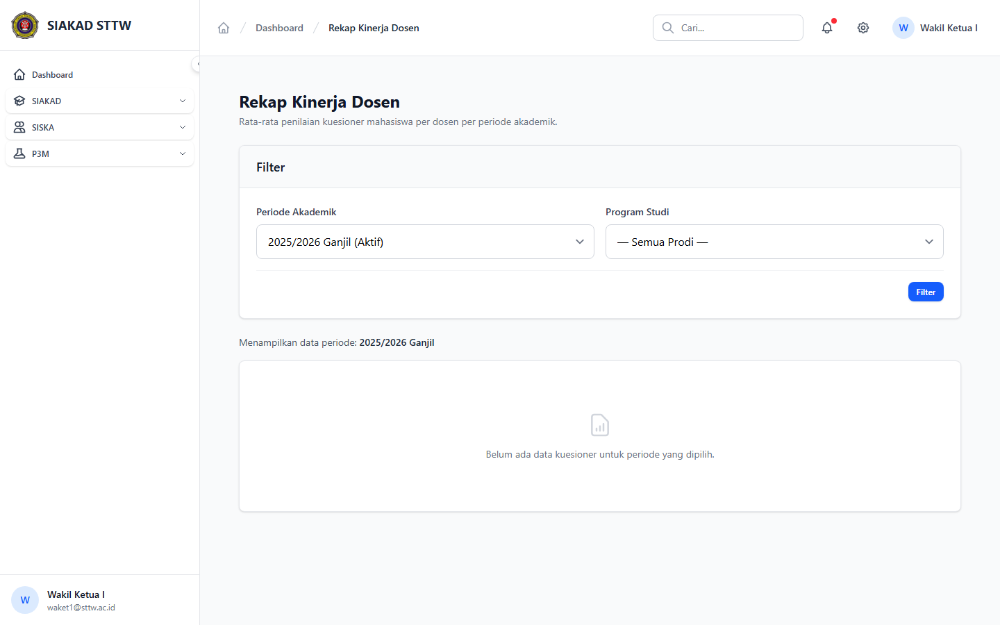
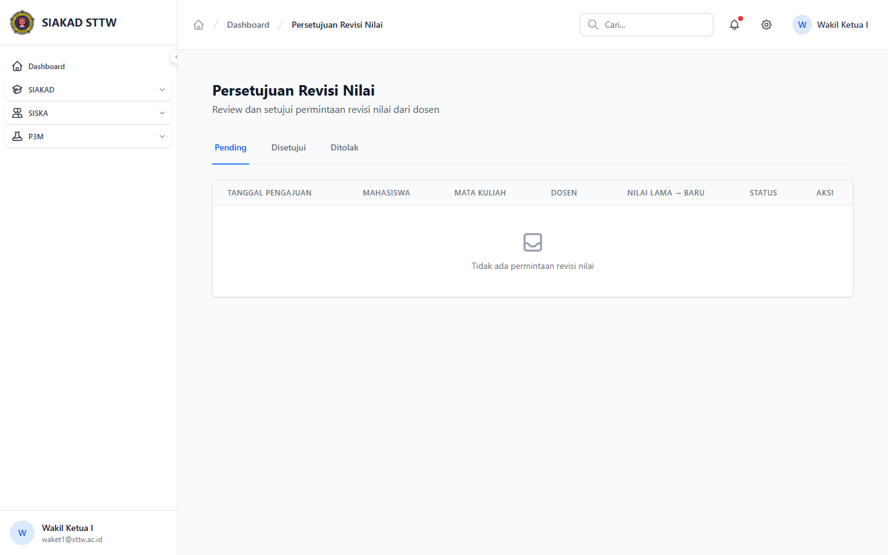
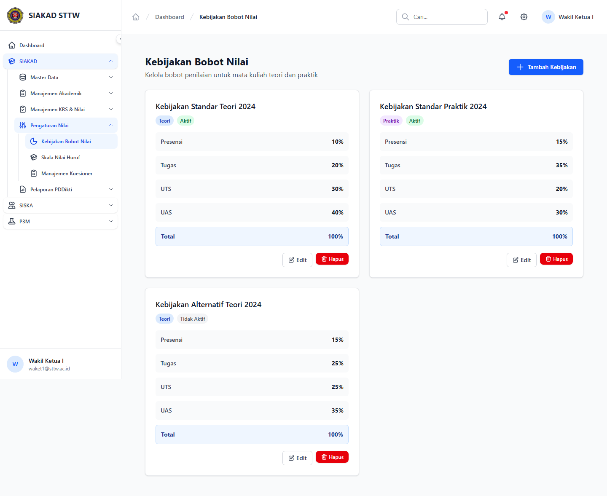
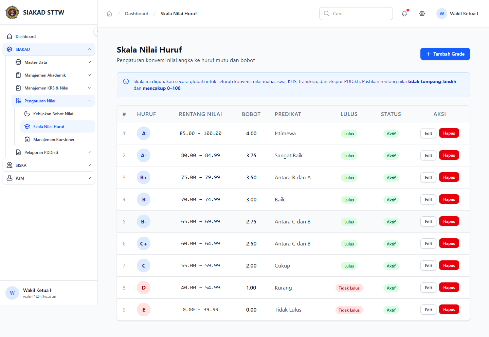
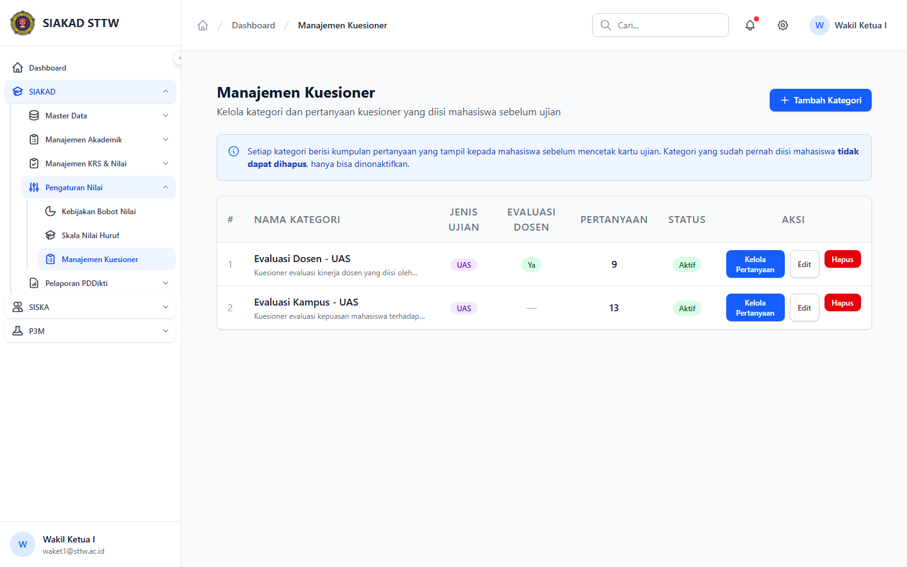
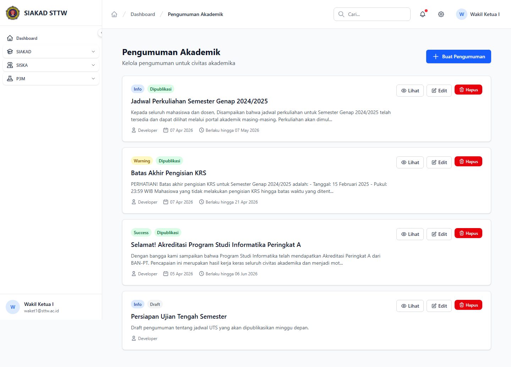

# SIAKAD — Waket1 Monitoring (Waket1)

- **Tanggal:** 2026-04-22
- **Role:** waket1 (`waket1@sttw.ac.id`)
- **Modul:** SIAKAD → Monitoring & Penilaian (Waket1)
- **Status:** ❌ Gap — 1 bug P1 (HTTP 500) di `/siakad/monitoring`

## Ringkasan

Scan area Waket1 di SIAKAD: dashboard monitoring, rekap kinerja dosen, revisi nilai, bobot/skala nilai, kuesioner, dan pengumuman akademik. Semua sub-page selain `/siakad/monitoring` render normal. **`/siakad/monitoring` mengalami HTTP 500** karena query SQL yang menyertakan `LIMIT` di dalam subquery `IN (...)` ditolak MySQL — lihat Temuan.

## Halaman

| # | Halaman | URL | Status |
|---|---|---|---|
| 1 | Monitoring Akademik | `/siakad/monitoring` | **500** |
| 2 | Rekap Kinerja Dosen | `/siakad/rekap-kinerja-dosen` | 200 |
| 3 | Revisi Nilai — Index | `/siakad/revisi-nilai` | 200 |
| 4 | Bobot Nilai — Index | `/siakad/bobot-nilai` | 200 |
| 5 | Skala Huruf — Index | `/siakad/skala-huruf` | 200 |
| 6 | Kuesioner — Index | `/siakad/kuesioner` | 200 |
| 7 | Pengumuman Akademik | `/siakad/pengumuman` | 200 |

## Screenshots

### 03 Monitoring Akademik (HTTP 500)

### 04 Rekap Kinerja Dosen

### 05 Revisi Nilai — Index

### 06 Bobot Nilai — Index

### 07 Skala Huruf — Index

### 08 Kuesioner — Index

### 09 Pengumuman Akademik

## Temuan & Masalah

### ❌ P1 — `/siakad/monitoring` HTTP 500 (LIMIT inside IN subquery rejected by MySQL)

**Issue:** [#138](https://github.com/ricomuh/siakad-sttw/issues/138)

`Waket1\MonitoringController::index` membangun query `ipkPerProdi` dengan correlated subquery menggunakan `LIMIT 1` di dalam `IN (...)`. MySQL menolak: `1235 This version of MySQL doesn't yet support 'LIMIT & IN/ALL/ANY/SOME subquery'`.

**Suggested fix:** wrap subquery dalam derived table (`SELECT id FROM (... LIMIT 1) AS latest`), atau refactor join via `status_nilai_semester` terbaru per mahasiswa pakai window function/grouped subquery. Detail lengkap di issue #138.

## Catatan Skenario

- Halaman lain (rekap-kinerja-dosen, kuesioner, pengumuman) berfungsi normal.
- Recording menggunakan akun `waket1@sttw.ac.id` (seeded by `RolePermissionSeeder`).
