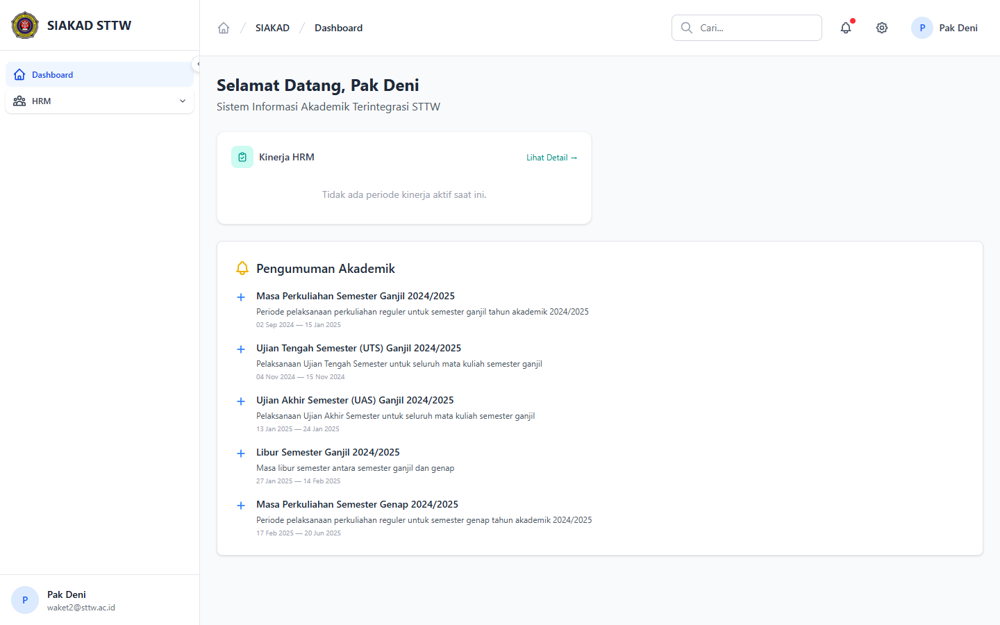
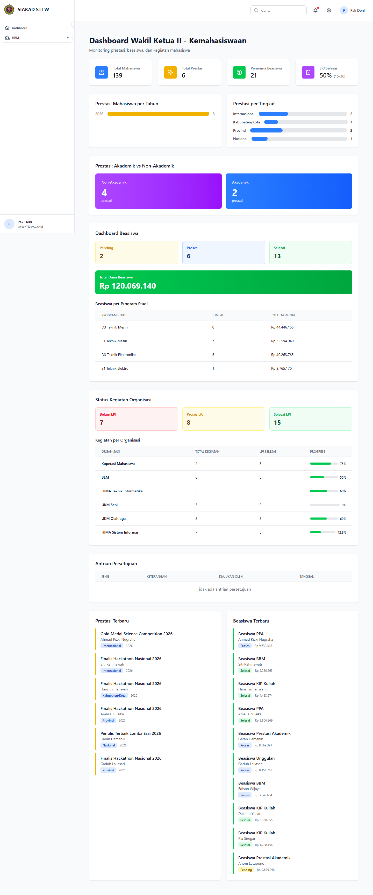
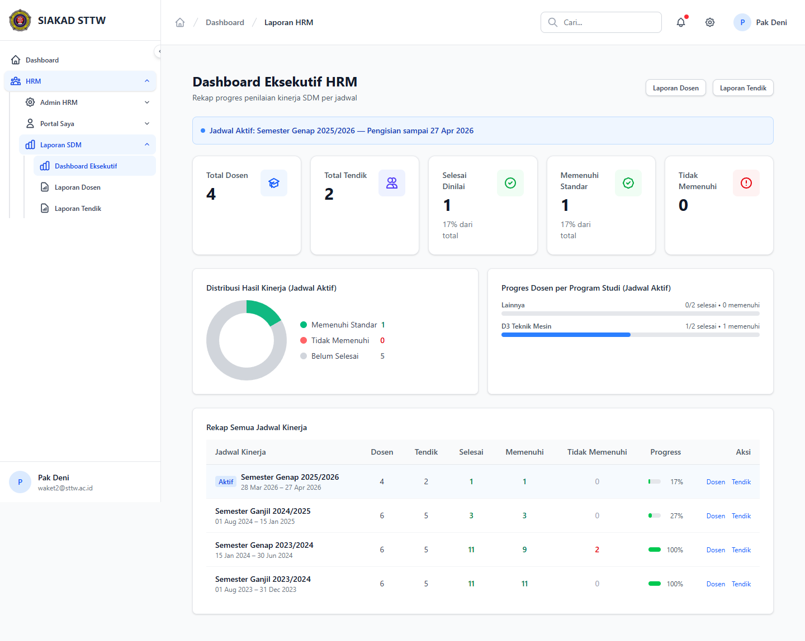
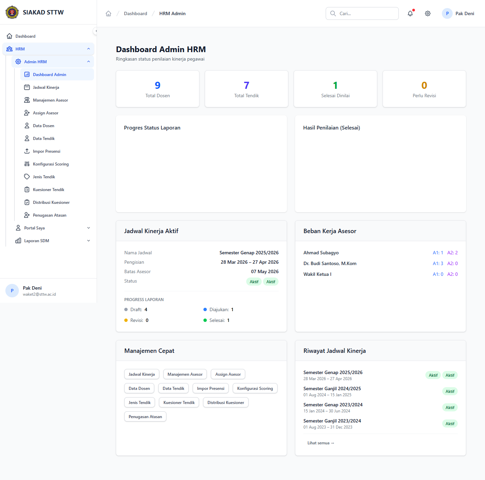
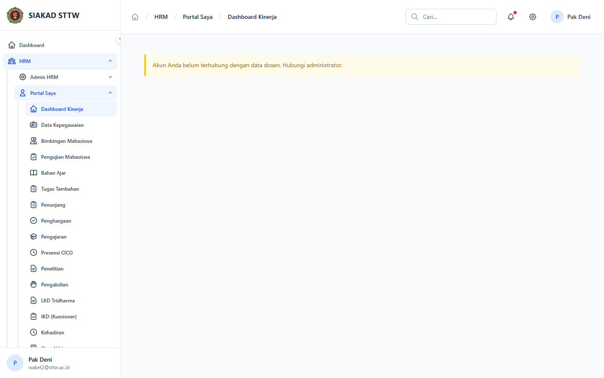

# Laporan Workflow — Waket 2: Monitoring HRM & SISKA

**Tanggal:** 2026-04-22
**Penguji:** Agen Otomatis (Session B)
**Modul:** HRM & SISKA — perspektif Waket 2
**Akun Diuji:** `waket2@sttw.ac.id` (role `waket2`, profil "Pak Deni")
**Sumber Plan:** `plan/2026-04-21-process-workflow-reporter-all-modules-1.md` — TASK-015 (sebelumnya ⚠️ Partial)

## Skenario

Memverifikasi cakupan halaman monitoring yang dapat diakses oleh role `waket2`. Sebelum sesi ini, scope monitoring waket2 belum terdokumentasi. Sesi ini juga mengkonfirmasi batas otorisasi terhadap monitoring KRS dan monitoring KKN.

## Langkah Pengujian

### 1. Dashboard utama

Login `waket2@sttw.ac.id` membawa pengguna ke `/dashboard`. Dashboard menampilkan sambutan personal dan kartu pengumuman akademik. Sidebar yang terlihat hanya berisi grup SIAKAD (collapsed) dan tautan langsung HRM Portal.

### 2. SISKA Dashboard

`GET /siska/dashboard` (controller `Waket2DashboardController`) menampilkan ringkasan agregat SISKA: total mahasiswa aktif PKL/KKN/TA/Skripsi, status kewajiban, serta panel statistik wisuda.

### 3. HRM Laporan Dashboard

`GET /hrm/laporan` (controller `Hrm\Laporan\LaporanController@dashboard`) menampilkan ringkasan kinerja periode aktif beserta tautan ke laporan dosen (`/hrm/laporan/dosen`) dan tendik (`/hrm/laporan/tendik`).

### 4. HRM Admin Dashboard

`GET /hrm/admin` (controller `Hrm\Admin\AdminDashboardController`) berfungsi sebagai pusat kendali HRM: jumlah laporan menunggu verifikasi, rasio asesor, dan status periode. Waket 2 dapat masuk karena memiliki `hrm.admin.manage`.

### 5. HRM Portal Dosen

`GET /hrm/portal` adalah portal personal Pak Deni (sebagai dosen) untuk submit kinerja sendiri. Akses default tanpa permission tambahan karena memakai `hrm.profil.view`.

## Fitur Yang Diuji

| Fitur | Endpoint | Status |
|---|---|---|
| Dashboard utama | `GET /dashboard` | ✅ |
| SISKA Dashboard (Waket2DashboardController) | `GET /siska/dashboard` | ✅ |
| HRM Laporan Dashboard | `GET /hrm/laporan` | ✅ |
| HRM Admin Dashboard | `GET /hrm/admin` | ✅ |
| HRM Portal personal | `GET /hrm/portal` | ✅ |
| Monitoring Akademik (Waket1) | `GET /siakad/monitoring` | 🚫 403 (di luar scope waket2) |
| Monitoring KRS | `GET /siakad/monitoring-krs` | 🚫 403 (di luar scope waket2) |
| Monitoring KKN | `GET /siska/kkn/monitoring` | 🚫 403 (di luar scope waket2) |

## Temuan & Masalah

**Finding F-2026-04-22-02 (Informational)** — Permission set role `waket2` saat ini hanya mencakup HRM (`hrm.admin.manage`, `hrm.kinerja.*`, `hrm.laporan.*`, `hrm.scoring.config`) plus akses dashboard SISKA (`Waket2DashboardController` tidak diproteksi permission khusus). Halaman monitoring SIAKAD/SISKA detail (`siakad.monitoring*`, `siska.kkn.monitoring`, `siska.lpj.*`, `siska.kewajiban.*`) tidak dapat diakses karena role waket2 tidak diberi permission terkait pada `RolePermissionSeeder`. Bila stakeholder menginginkan waket2 melihat monitoring akademik & SISKA penuh, perlu update seeder. Saat ini waket2 hanya menjadi penanggung jawab HRM + ringkasan SISKA.

## Catatan

Halaman yang return 403 sengaja tidak dilampirkan screenshot agar laporan ringkas. Sesi ini menutup TASK-015 yang sebelumnya berstatus ⚠️ Partial pada plan workflow-reporter, sekaligus mendokumentasikan finding F-2026-04-22-02.
