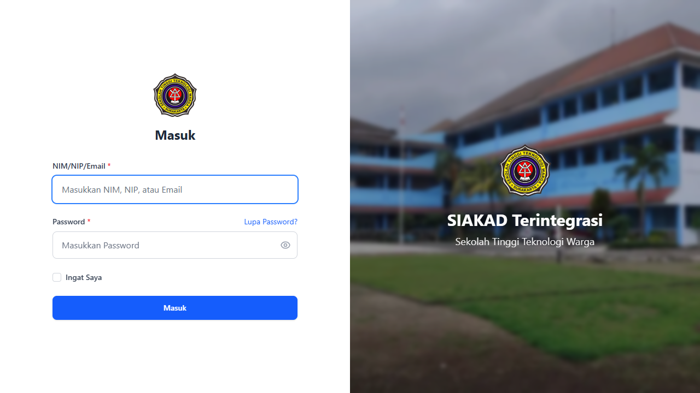
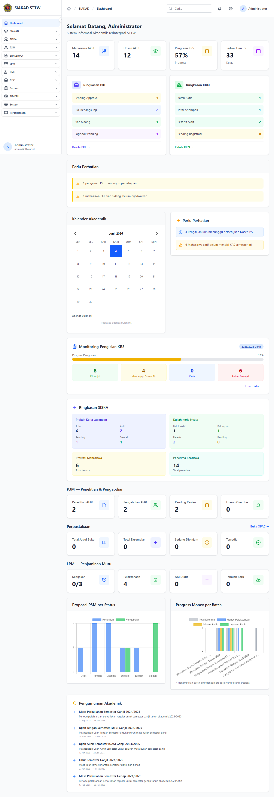
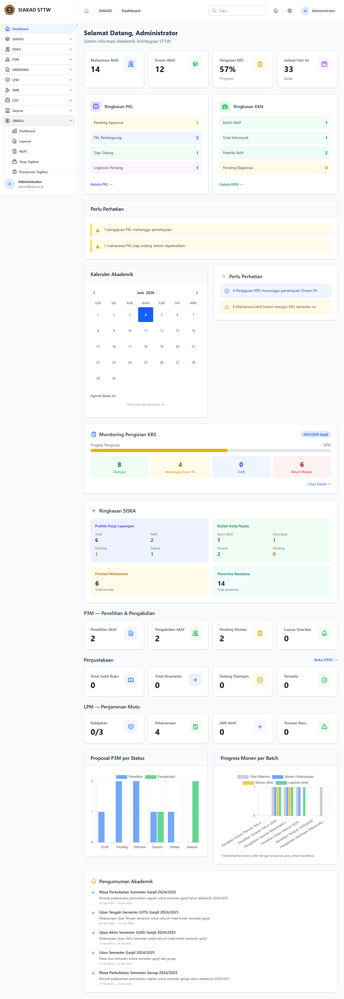
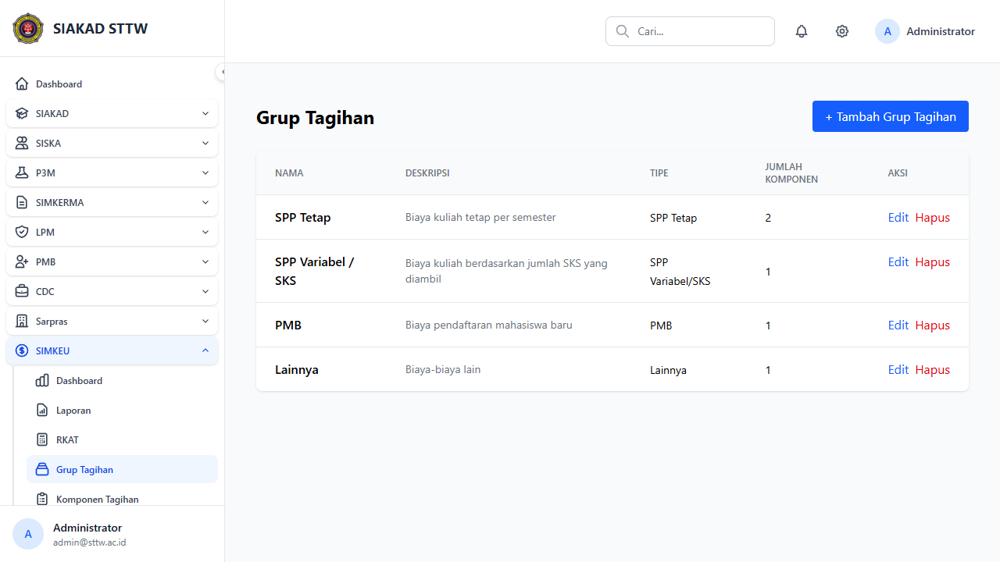
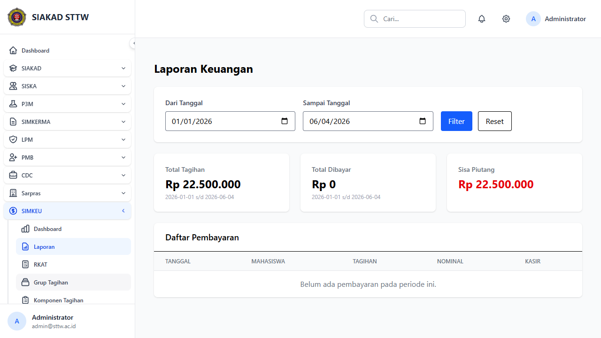
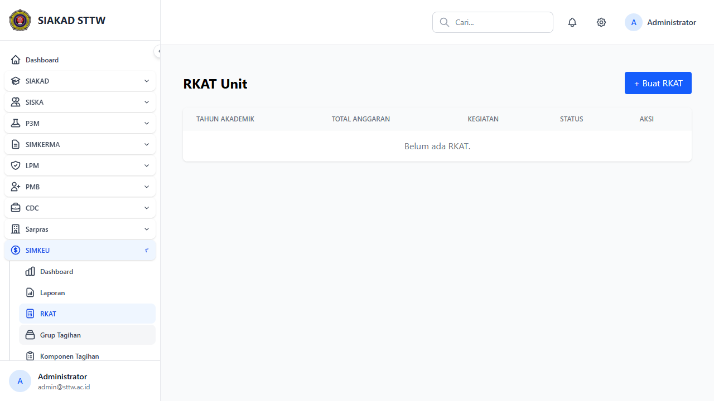
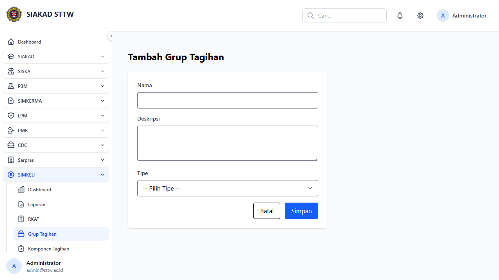
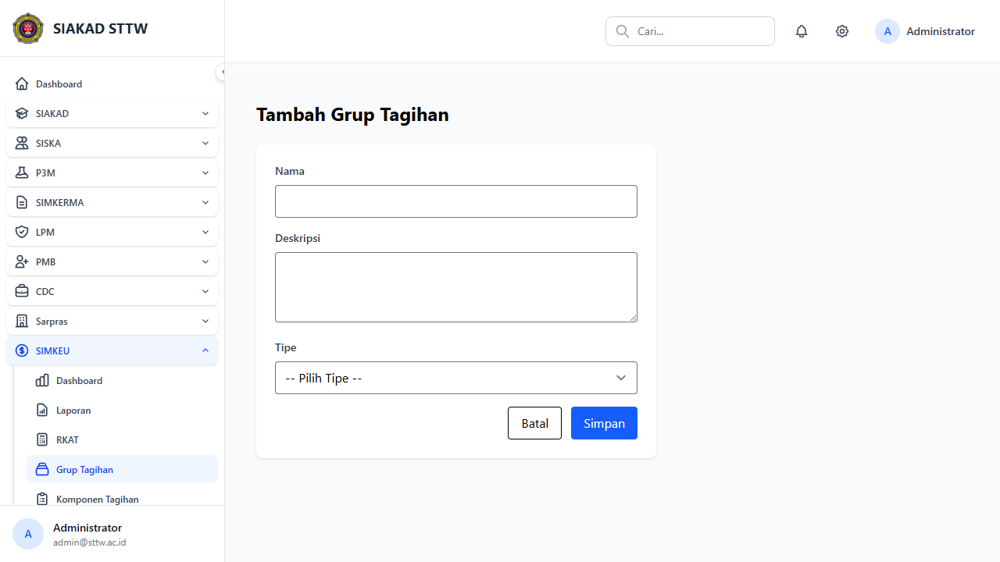

# Workflow Report: SIMKEU — Admin (Scan Awal)

**Tanggal**: 2026-06-04
**Role**: Administrator (admin@sttw.ac.id)
**Modul**: SIMKEU (Sistem Informasi Manajemen Keuangan)
**Fitur**: Semua halaman admin SIMKEU — Grup Tagihan, Komponen, Tarif, Bulk Tagihan, Pembayaran Kasir, Histori, Dashboard, Laporan, RKAT
**Status**: ✅ Berhasil — Semua halaman dapat diakses tanpa error

## Deskripsi Workflow

Workflow ini mendokumentasikan seluruh halaman yang dapat diakses oleh role Administrasi Keuangan pada modul SIMKEU. SIMKEU adalah modul baru yang mencakup pengelolaan tagihan mahasiswa, pembayaran kasir, pembuatan kwitansi, Virtual Account via PMB, manajemen RKAT, izin KRS/Ujian, serta dashboard dan laporan keuangan.

Pengujian dilakukan dengan login sebagai user `admin@sttw.ac.id` yang memiliki role `administrasi_keuangan` dengan semua permission SIMKEU. Seluruh 63 route terdaftar, dan semua halaman diakses melalui sidebar.

## Ringkasan

Semua 14+ halaman SIMKEU berhasil diakses tanpa error HTTP. Data seeder berjalan dengan baik (4 grup tagihan, 5 komponen, 1 tarif, 1 rekening kas). Tidak ditemukan 500 error atau masalah permission. SIMKEU sidebar muncul dengan 10 menu items.

## Langkah-langkah

### 1. Halaman Login

**Deskripsi**: User login dengan kredensial admin untuk mengakses dashboard SIAKAD STTW.

**URL**: `http://127.0.0.1:8000/login`

### 2. Dashboard Utama

**Deskripsi**: Setelah login, dashboard utama menampilkan ringkasan SIAKAD. Sidebar di kiri menampilkan semua modul termasuk SIMKEU di bawah Sarpras.

**URL**: `http://127.0.0.1:8000/dashboard`

### 3. Sidebar SIMKEU — Expanded

**Deskripsi**: Klik grup SIMKEU pada sidebar untuk menampilkan sub-menu. Tampak 10 menu items: Dashboard, Laporan, RKAT, Grup Tagihan, Komponen Tagihan, Tarif Komponen, Generate Tagihan Massal, Daftar Tagihan, Pembayaran Kasir, Histori Pembayaran. Tidak tampak "Izin KRS/Ujian" — perlu dicek apakah menu ini sudah ditambahkan di sidebar.

**URL**: `http://127.0.0.1:8000/dashboard`

### 4. Grup Tagihan — Index

**Deskripsi**: Halaman daftar grup tagihan (SPP Tetap, SPP Variabel/SKS, PMB, Lainnya) hasil seeder SimkeuSeeder. Tiap grup menampilkan nama, deskripsi, tipe, jumlah komponen. Tombol "+ Tambah Grup Tagihan" tersedia.

**URL**: `http://127.0.0.1:8000/simkeu/admin/grup-tagihan`

### 5. Komponen Tagihan — Index

**Deskripsi**: Halaman daftar komponen tagihan yang tergabung dalam grup. Menampilkan nama komponen, grup, nominal default, dan status aktif/nonaktif.

**URL**: `http://127.0.0.1:8000/simkeu/admin/komponen-tagihan`

### 6. Tarif Komponen — Index

**Deskripsi**: Halaman daftar tarif komponen per prodi dan angkatan. Menampilkan komponen, program studi, angkatan, dan nominal tarif.

**URL**: `http://127.0.0.1:8000/simkeu/admin/tarif-komponen`

### 7. Generate Tagihan Massal — Step 1

**Deskripsi**: Wizard step 1 untuk generate tagihan massal. Form berisi filter prodi, angkatan, semester, jatuh tempo, dan checkbox komponen tagihan per grup.

**URL**: `http://127.0.0.1:8000/simkeu/admin/bulk-tagihan`

### 8. Daftar Tagihan

**Deskripsi**: Halaman daftar semua tagihan mahasiswa. Terdapat filter prodi, angkatan, status bayar, dan pencarian NIM/nama. Tabel menampilkan NIM, nama, prodi, jenis tagihan, jumlah, status, dan jatuh tempo.

**URL**: `http://127.0.0.1:8000/simkeu/admin/tagihan`

### 9. Pembayaran Kasir

**Deskripsi**: Halaman pembayaran kasir dengan pencarian mahasiswa via NIM (AJAX). Menampilkan field pencarian NIM, dan area yang akan menampilkan info mahasiswa + daftar tagihan + form pembayaran setelah pencarian.

**URL**: `http://127.0.0.1:8000/simkeu/kasir/pembayaran`

### 10. Histori Pembayaran

**Deskripsi**: Halaman histori pembayaran dengan filter tanggal, metode, dan pencarian. Tabel menampilkan tanggal, NIM, nama, jenis tagihan, nominal, metode, dan nomor kwitansi.

**URL**: `http://127.0.0.1:8000/simkeu/kasir/histori`

### 11. Dashboard Admin Keuangan

**Deskripsi**: Dashboard keuangan untuk Administrasi Keuangan menampilkan statistik: total tagihan semester, total dibayar, pending, overdue, grafik pendapatan per bulan, dan recent payments.

**URL**: `http://127.0.0.1:8000/simkeu/admin/dashboard`

### 12. Laporan Keuangan

**Deskripsi**: Halaman laporan keuangan dengan filter tanggal (dari-sampai), menampilkan summary total tagihan dan total pembayaran, serta tabel detail pembayaran.

**URL**: `http://127.0.0.1:8000/simkeu/admin/laporan`

### 13. RKAT — Index

**Deskripsi**: Halaman daftar usulan RKAT (Rencana Kerja Anggaran Tahunan) untuk role Unit/Prodi. Menampilkan tabel dengan kolom tahun akademik, total anggaran, status, dan aksi CRUD.

**URL**: `http://127.0.0.1:8000/simkeu/unit/rkat`

### 14. Grup Tagihan — Create (Form)

**Deskripsi**: Form tambah grup tagihan. Fields: nama (text), deskripsi (textarea), tipe (select dropdown enum: spp_tetap, spp_variabel, pmb, lainnya).

**URL**: `http://127.0.0.1:8000/simkeu/admin/grup-tagihan/create`

## Temuan & Masalah

| # | Halaman | URL | Kategori | Deskripsi | Screenshot | Prioritas |
|---|---------|-----|----------|-----------|------------|-----------|
| 1 | Sidebar SIMKEU | /dashboard | `missing-sidebar` | Menu "Izin KRS/Ujian" tidak muncul di sidebar SIMKEU meskipun route dan controllernya sudah dibuat |  | Medium |
| 2 | Dashboard Admin | /simkeu/admin/dashboard | `no-data` | Dashboard menampilkan Rp 0 dan 0 data karena belum ada data tagihan/pembayaran real |  | Low |

## Catatan

- Dev server berjalan di `http://127.0.0.1:8000`
- Login: admin@sttw.ac.id / password
- SIMKEU sidebar: 10 menu items terdeteksi (termasuk RKAT di bawah SIMKEU)
- **Belum dicek**: halaman mahasiswa portal, WK2 dashboard, Pimpinan dashboard, Izin KRS/Ujian, create/update form lainnya, delete confirmation
- Data seeder SimkeuSeeder berhasil: 4 grup tagihan, 5 komponen tagihan, 1 tarif, 1 rekening kas
- Status tagihan: semua 0 karena belum ada tagihan mahasiswa yang di-generate
- Semua halaman return HTTP 200 — tidak ada 5xx/4xx error
- Browser console: 0 error, 0 warning
