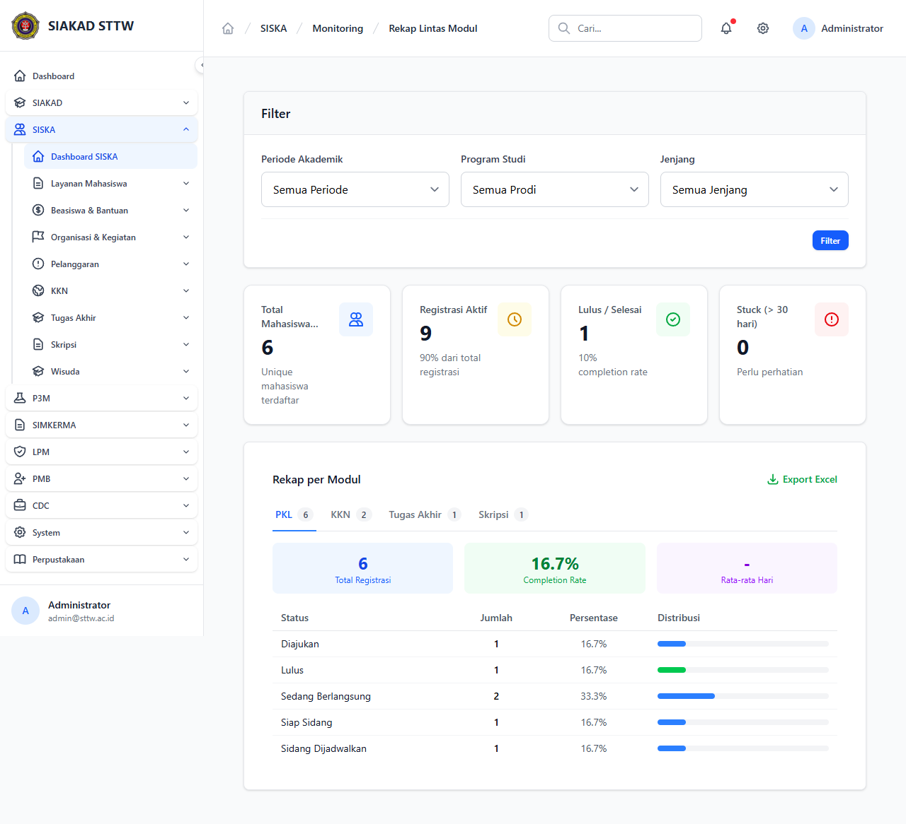

# Workflow Report: Monitoring Rekap SISKA Admin

**Tanggal**: 2026-05-12
**Role**: admin
**Modul**: siska
**Fitur**: admin-monitoring-rekap
**Status**: ✅ Berhasil

## Deskripsi Workflow

Rekap monitoring SISKA (PKL/KKN/TA/Skripsi) lintas prodi (referensi memory: dual permission siska.monitoring.rekap & siska.monitoring.rekap-prodi).

## Ringkasan

- HTTP 200, render OK.
- Komponen Blade standar (<x-table>, <x-card>, <x-button>).
- Tidak ada error blade visible.

## Langkah-langkah

### 1. Buka halaman

**Deskripsi**: Login admin, navigasi ke halaman target.

**URL**: `http://127.0.0.1:8000/siska/monitoring/rekap`

## Temuan & Masalah

Tidak ada temuan baru. Tabel dapat tampil kosong (lingkungan SQLite minim seed).

## Catatan

- Bagian dari batch refresh delta pertengahan April 2026.
