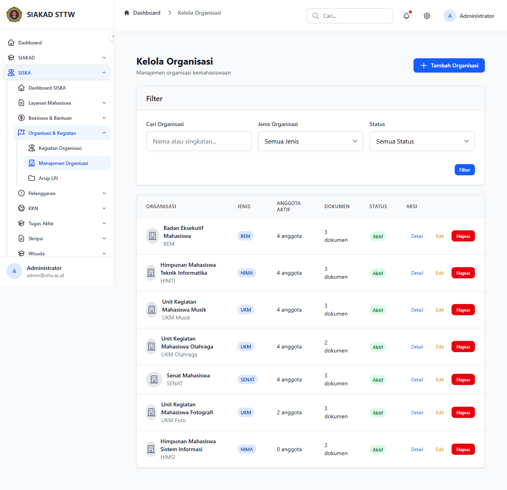

# Workflow Report: SISKA Kelola Organisasi

**Tanggal**: 2026-05-12
**Role**: admin
**Modul**: siska
**Fitur**: admin-organisasi
**Status**: ✅ Berhasil

## Deskripsi Workflow

Kelola organisasi mahasiswa.

## Ringkasan

Halaman diakses sebagai admin pada delta scan pertengahan April 2026.

## Langkah-langkah

### 1. Buka halaman SISKA Kelola Organisasi

**Deskripsi**: Admin membuka `/siska/organisasi` melalui sidebar.

**URL**: `http://127.0.0.1:8000/siska/organisasi`

## Temuan & Masalah

_Tidak ada temuan signifikan._

## Catatan

- Diambil otomatis pada batch scan delta pertengahan April 2026.
