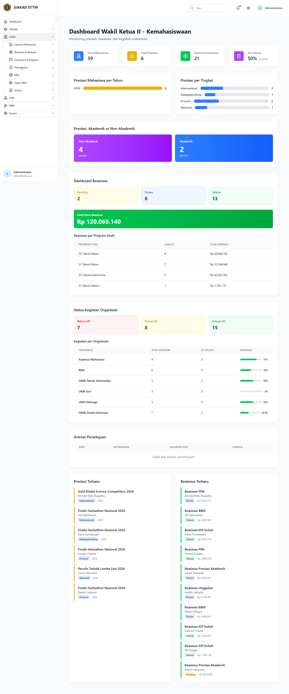
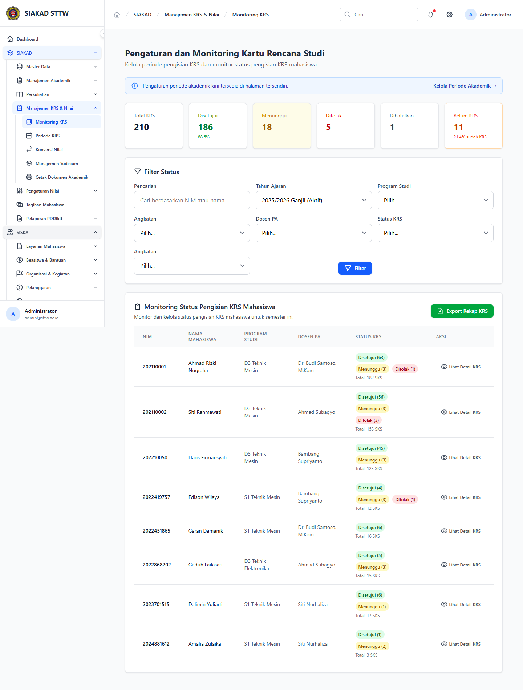

# Workflow Report: Overview Modul SISKA

**Tanggal**: 2026-04-19
**Role**: Administrator (admin@sttw.ac.id)
**Modul**: SISKA
**Fitur**: Overview Modul
**Status**: ⚠️ Partial

## Deskripsi Workflow

Dokumentasi ini merekam overview modul SISKA dari perspektif administrator. Verifikasi awal dilakukan pada struktur sidebar `SISKA`, kemudian halaman overview dibuka pada route `siska/dashboard` untuk melihat ringkasan kemahasiswaan, prestasi, beasiswa, kegiatan organisasi, dan antrean persetujuan.

## Ringkasan

Halaman overview SISKA dapat diakses dan menampilkan data ringkasan dengan baik. Namun, entry point overview tersebut belum tampak sebagai item navigasi yang jelas di sidebar admin aktif, sehingga pengaksesan halaman overview masih mengandalkan URL langsung.

## Langkah-langkah

### 1. Dashboard SISKA

**Deskripsi**: Halaman `siska/dashboard` menampilkan dashboard kemahasiswaan dengan statistik total mahasiswa, prestasi, penerima beasiswa, progress LPJ, distribusi prestasi, dashboard beasiswa, status kegiatan organisasi, serta daftar prestasi dan beasiswa terbaru. Screenshot ini diambil setelah konteks modul `SISKA` dibuka pada sidebar.

**URL**: `http://localhost:8000/siska/dashboard`

## Temuan & Masalah

| # | Halaman | URL | Kategori | Deskripsi | Screenshot | Prioritas |
|---|---------|-----|----------|-----------|------------|-----------|
| 1 | Sidebar SISKA | `/siska/dashboard` | `missing-sidebar` | Halaman overview SISKA dapat dibuka, tetapi tidak muncul sebagai item navigasi yang jelas pada sidebar admin aktif. Untuk merekam dashboard ini, akses dilakukan lewat URL langsung. |  | Medium |

## Catatan

- Dashboard yang direkam adalah overview yang dapat diakses administrator pada route `siska/dashboard`.
- Struktur sidebar SISKA yang terlihat pada sesi admin lebih menonjolkan submenu fitur, bukan entry point overview modul.
- Karena jalur klik standar ke dashboard overview belum jelas, status report ditandai `Partial`.
