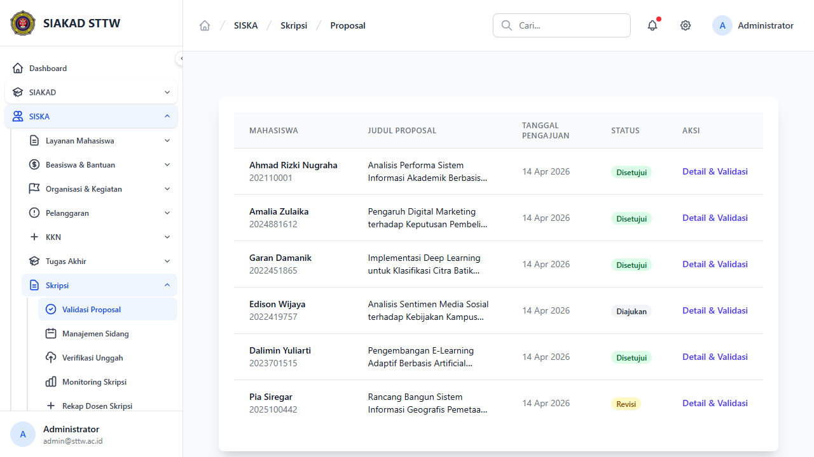
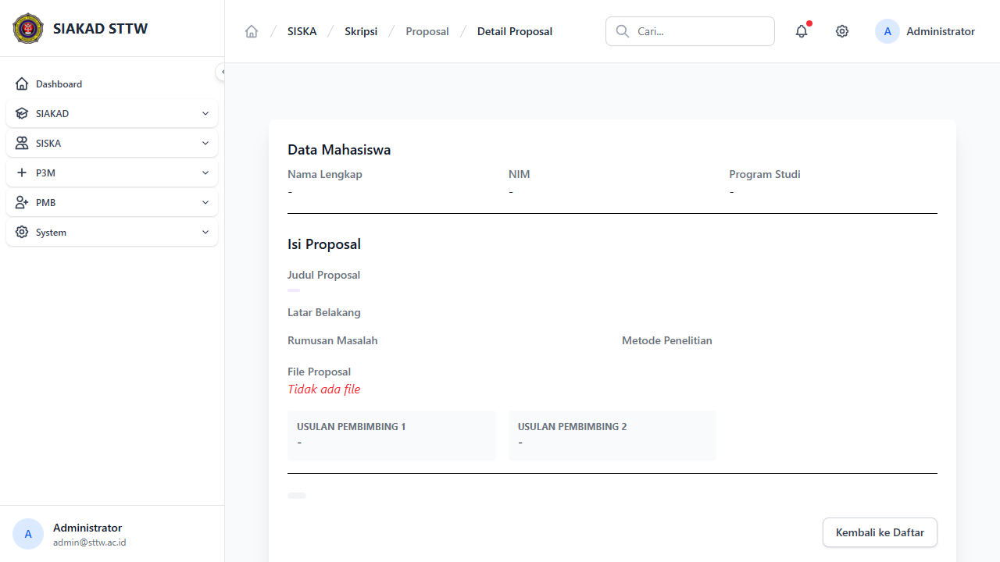
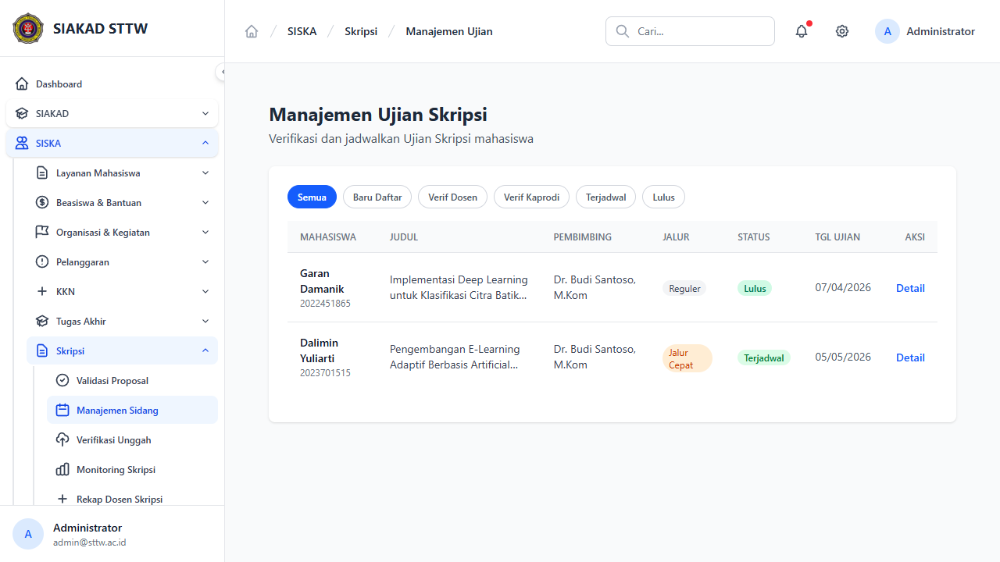
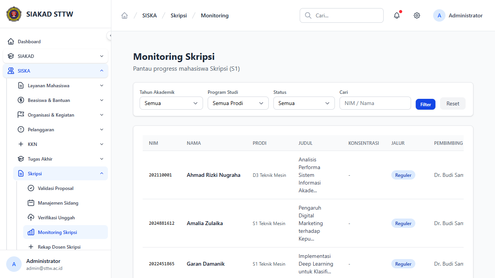
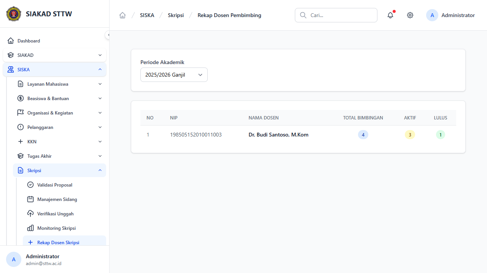
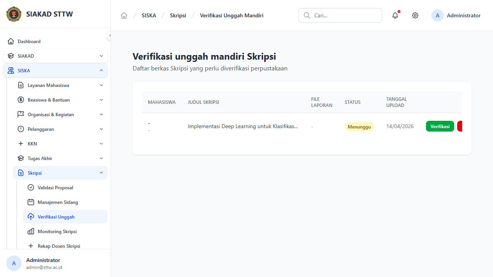

# Workflow Report: Skripsi — Admin

**Tanggal**: 2026-04-14
**Role**: Admin (admin@sttw.ac.id)
**Modul**: SISKA — Skripsi
**Status**: ✅ Berhasil (7/7 halaman OK)

## Ringkasan

Dokumentasi alur kerja admin dalam mengelola modul Skripsi. Admin memiliki akses ke 5 menu: Validasi Proposal, Manajemen Ujian, Verifikasi Unggah, Monitoring Skripsi, dan Rekap Dosen Skripsi.

## Langkah-langkah

### 1. Proposals Admin — Daftar Proposal
**URL**: `/siska/skripsi/proposals-admin`
**Status**: ✅ OK

Menampilkan daftar seluruh proposal skripsi mahasiswa. Tabel: Mahasiswa, Judul Proposal, Tanggal Pengajuan, Status, Aksi.

Data saat ini (6 proposal):
| Mahasiswa | Status |
|---|---|
| Ahmad Rizki Nugraha | Disetujui |
| Amalia Zulaika | Disetujui |
| Garan Damanik | Disetujui |
| Edison Wijaya | Diajukan |
| Dalimin Yuliarti | Disetujui |
| Pia Siregar | Revisi |

Link "Detail & Validasi" mengarah ke route admin `/siska/skripsi/proposals-admin/{id}`.

---

### 2. Proposal Detail & Validasi
**URL**: `/siska/skripsi/proposals-admin/{id}`
**Status**: ✅ OK

Detail proposal skripsi. Menampilkan data mahasiswa (nama, NIM, prodi), judul, abstrak, dosen pembimbing, status, dan tombol aksi admin untuk approve/reject.

---

### 3. Manajemen Ujian
**URL**: `/siska/skripsi/admin/ujians`
**Status**: ✅ OK

Daftar ujian skripsi dengan tab filter status. Tabel: Mahasiswa, Judul, Pembimbing, Jalur, Status, Tgl Ujian, Aksi.

---

### 4. Jadwal Sidang
**URL**: `/siska/skripsi/sidangs`
**Status**: ✅ OK

Manajemen jadwal sidang skripsi. Admin dapat membuat, mengedit, dan melihat detail sidang.

---

### 5. Monitoring Skripsi
**URL**: `/siska/skripsi/monitoring`
**Status**: ✅ OK

Monitoring progress seluruh mahasiswa skripsi. Filter: Tahun Akademik, Program Studi, Status, Pencarian.

---

### 6. Rekap Dosen Pembimbing
**URL**: `/siska/skripsi/rekap-dosen`
**Status**: ✅ OK

Rekap dosen pembimbing skripsi per periode. Tabel: No, NIP, Nama Dosen, Total Bimbingan, Aktif, Lulus.

---

### 7. Verifikasi Unggah Mandiri
**URL**: `/siska/skripsi/unggah-mandiri-admin`
**Status**: ✅ OK

Verifikasi berkas skripsi yang diunggah mahasiswa untuk perpustakaan.

---

## Catatan

- Semua 7 halaman admin Skripsi berfungsi tanpa error
- 6 proposal skripsi terdaftar dengan berbagai status
- Struktur dan fitur identik dengan modul TA
