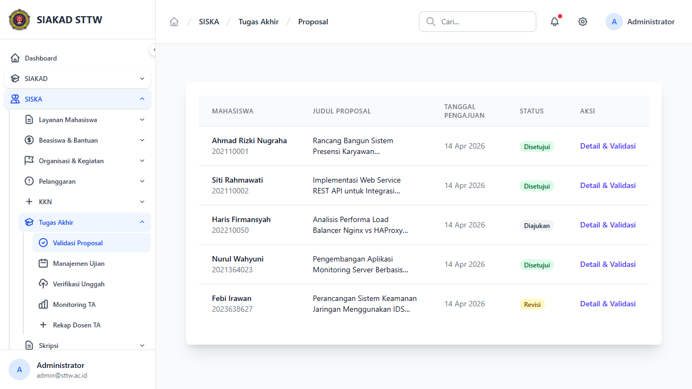
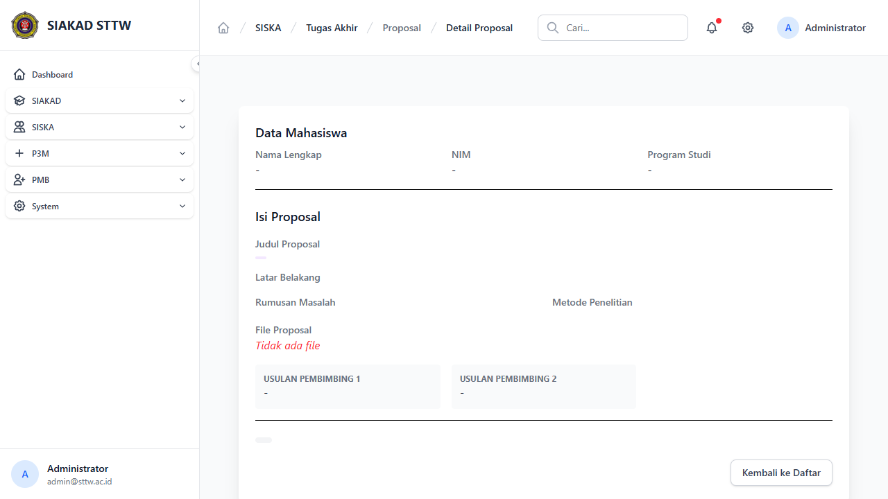
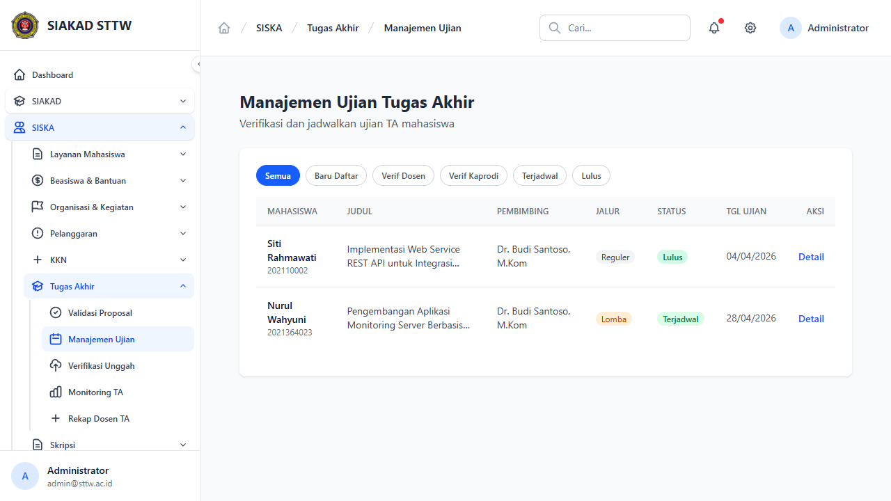
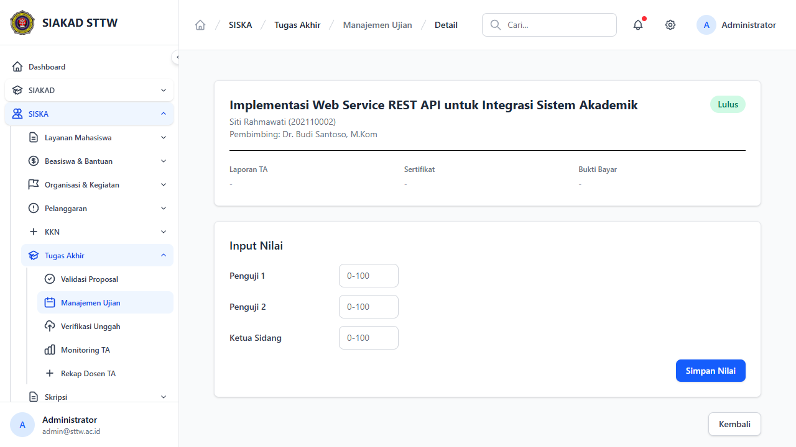
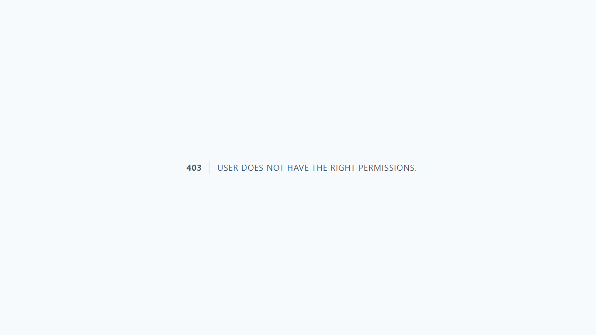
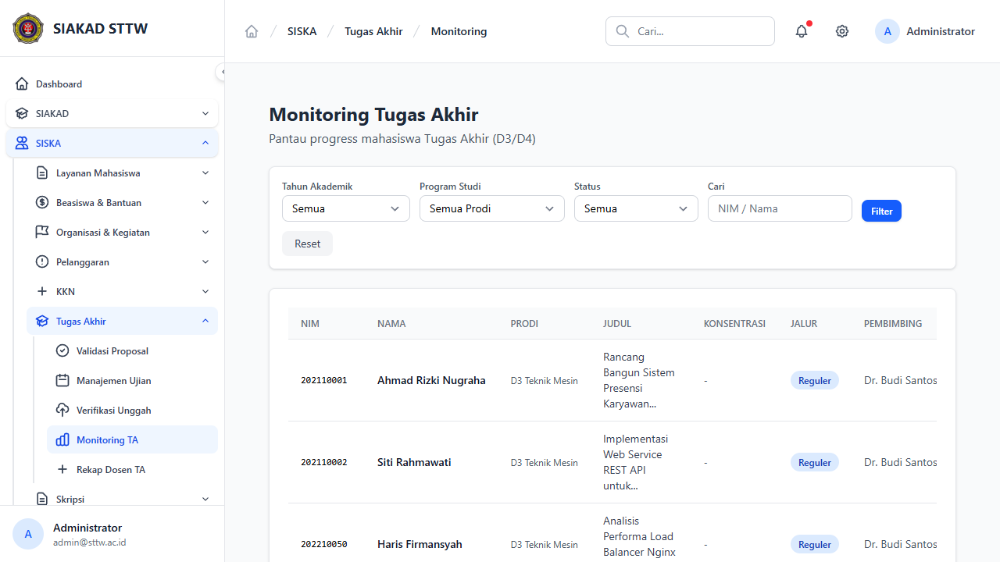
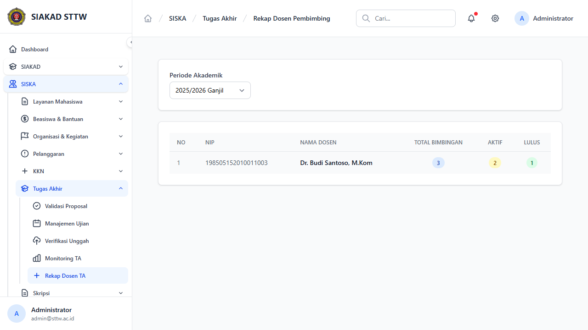
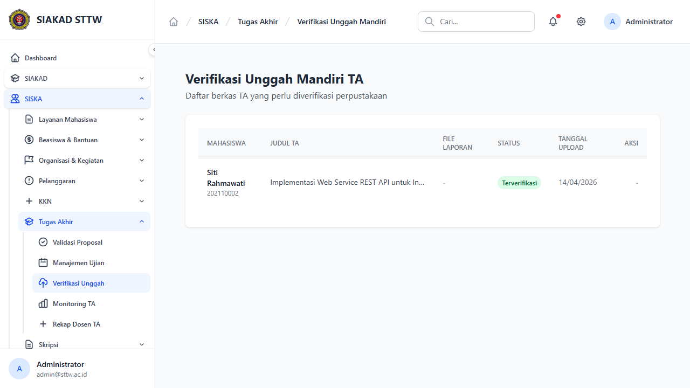

# Workflow Report: Tugas Akhir — Admin

**Tanggal**: 2026-04-14
**Role**: Admin (admin@sttw.ac.id)
**Modul**: SISKA — Tugas Akhir
**Status**: ✅ Berhasil (8/8 halaman OK)

## Ringkasan

Dokumentasi alur kerja admin dalam mengelola modul Tugas Akhir (TA). Admin memiliki akses ke 5 menu utama pada sidebar: Validasi Proposal, Manajemen Ujian, Verifikasi Unggah, Monitoring TA, dan Rekap Dosen TA.

## Langkah-langkah

### 1. Proposals Admin — Daftar Proposal
**URL**: `/siska/ta/proposals-admin`
**Status**: ✅ OK

Menampilkan daftar seluruh proposal TA mahasiswa. Tabel berisi kolom: Mahasiswa, Judul Proposal, Tanggal Pengajuan, Status, dan Aksi.

Data saat ini (5 proposal):
| Mahasiswa | NIM | Status |
|---|---|---|
| Ahmad Rizki Nugraha | 202110001 | Disetujui |
| Siti Rahmawati | 202110002 | Disetujui |
| Haris Firmansyah | 202210050 | Diajukan |
| Nurul Wahyuni | 2021364023 | Disetujui |
| Febi Irawan | 2023638627 | Revisi |

Link "Detail & Validasi" mengarah ke route admin `/siska/ta/proposals-admin/{id}`.

---

### 2. Proposal Detail & Validasi
**URL**: `/siska/ta/proposals-admin/1`
**Status**: ✅ OK

Menampilkan detail proposal TA. Halaman berisi:
- **Data Mahasiswa**: Nama, NIM, Program Studi
- **Detail Proposal**: Judul, tanggal pengajuan, status
- **Dosen Pembimbing**: Nama dosen yang ditugaskan
- **Aksi Admin**: Tombol approve/reject untuk validasi proposal

---

### 3. Manajemen Ujian — Daftar
**URL**: `/siska/ta/admin/ujians`
**Status**: ✅ OK

Menampilkan daftar ujian TA. Memiliki tab filter status: Semua, Baru Daftar, Verif Dosen, Verif Kaprodi, Terjadwal, Lulus.

Data saat ini (2 ujian):
| Mahasiswa | Jalur | Status | Tgl Ujian |
|---|---|---|---|
| Siti Rahmawati | Reguler | Lulus | 04/04/2026 |
| Nurul Wahyuni | Lomba | Terjadwal | 28/04/2026 |

---

### 4. Ujian Detail
**URL**: `/siska/ta/admin/ujians/1`
**Status**: ✅ OK

Detail ujian TA mahasiswa. Halaman berisi:
- **Header**: Judul TA, nama mahasiswa, NIM, pembimbing
- **Status**: Badge status ujian (Lulus)
- **Dokumen**: Upload Laporan TA, Sertifikat, Bukti Bayar
- **Input Nilai**: Form nilai Penguji 1, Penguji 2, Ketua Sidang
- **PDF**: Link cetak Berita Acara dan Surat Tugas

---

### 5. Sidang — Jadwal Sidang
**URL**: `/siska/ta/sidangs`
**Status**: ✅ OK

Menampilkan daftar jadwal sidang TA. Admin dapat membuat, mengedit, dan melihat detail jadwal sidang.

---

### 6. Monitoring TA
**URL**: `/siska/ta/monitoring`
**Status**: ✅ OK

Monitoring progress seluruh mahasiswa TA. Dilengkapi filter:
- Tahun Akademik, Program Studi, Status, Pencarian NIM/Nama

Tabel: NIM, Nama, Prodi, Judul, Konsentrasi, Jalur, Pembimbing, Tgl Ujian, Status.

---

### 7. Rekap Dosen Pembimbing
**URL**: `/siska/ta/rekap-dosen`
**Status**: ✅ OK

Rekap pembimbing TA per periode akademik. Tabel: No, NIP, Nama Dosen, Total Bimbingan, Aktif, Lulus.

---

### 8. Verifikasi Unggah Mandiri
**URL**: `/siska/ta/unggah-mandiri-admin`
**Status**: ✅ OK

Verifikasi berkas TA yang diunggah mahasiswa untuk perpustakaan. Tabel: Mahasiswa, Judul TA, File Laporan, Status, Tanggal Upload, Aksi.

---

## Catatan

- Semua 8 halaman admin TA berfungsi tanpa error
- Bug sebelumnya (500 pada detail proposal & link ke route salah) sudah diperbaiki
- 5 mahasiswa TA terdaftar dengan berbagai status (Disetujui, Diajukan, Revisi)
- Jalur TA mendukung: Reguler dan Lomba
- Status ujian: Daftar, Verif Dosen, Verif Kaprodi, Terjadwal, Lulus
