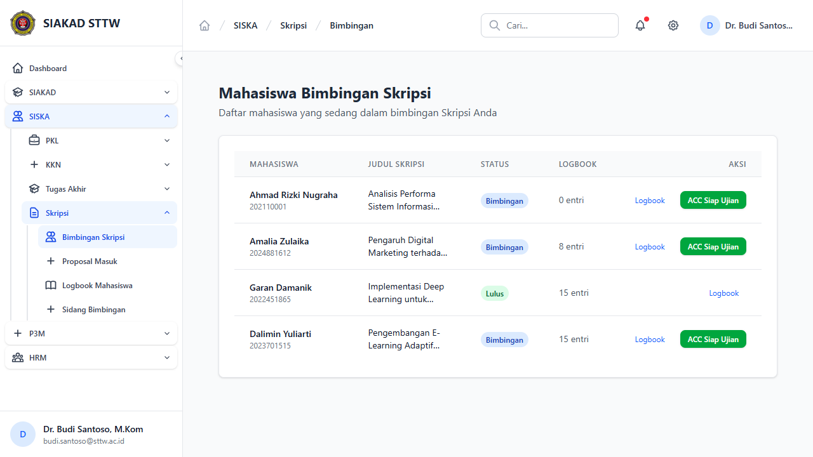
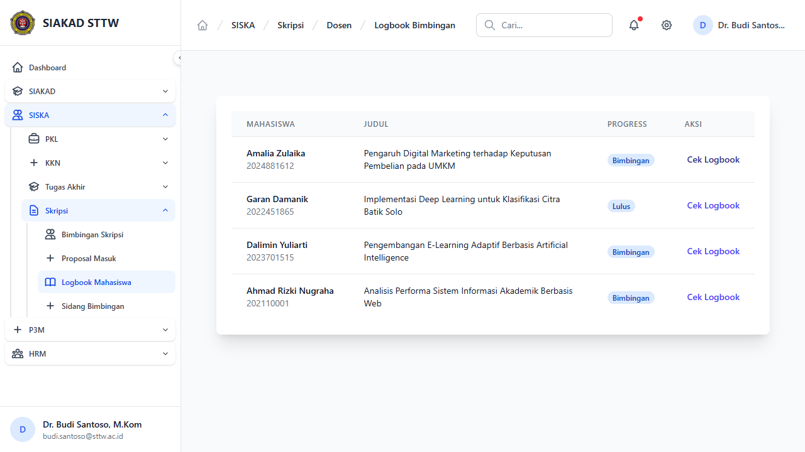
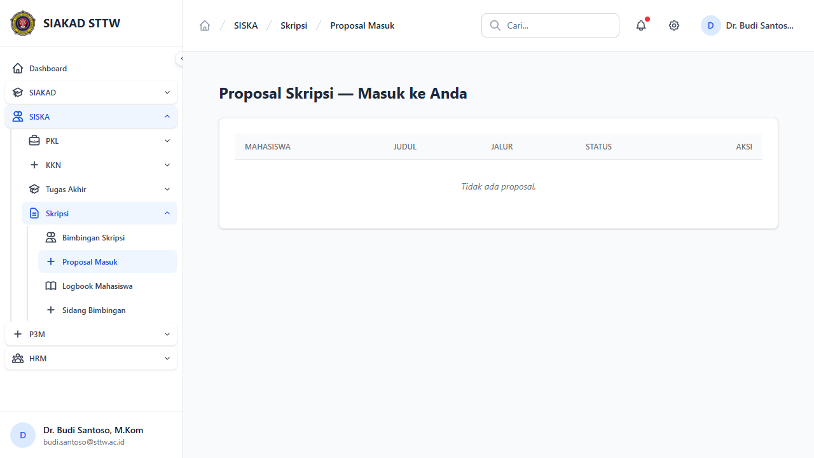
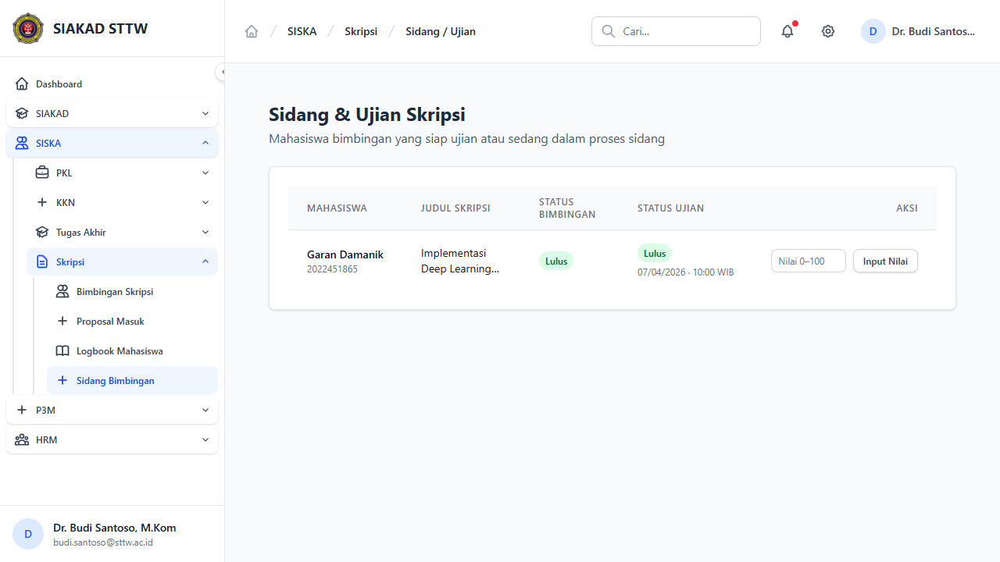
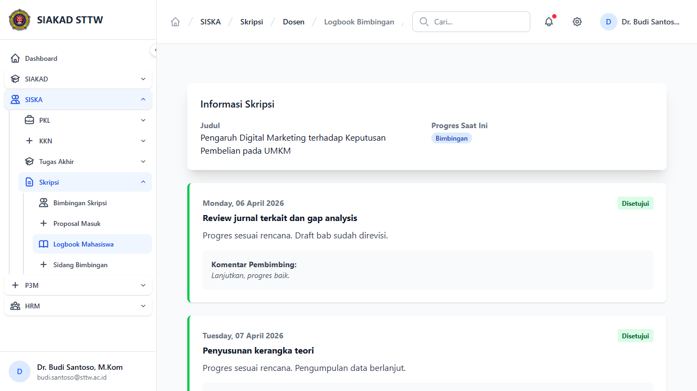

# Workflow Report: Skripsi — Dosen

**Tanggal**: 2026-04-14
**Role**: Dosen (budi.santoso@sttw.ac.id — Dr. Budi Santoso, M.Kom)
**Modul**: SISKA — Skripsi
**Status**: ✅ Berhasil (5/5 halaman OK)

## Ringkasan

Dokumentasi alur kerja dosen pembimbing Skripsi. Dosen memiliki akses ke 4 menu: Bimbingan, Logbook Mahasiswa, Proposal Masuk, dan Sidang.

## Langkah-langkah

### 1. Bimbingan — Daftar Mahasiswa
**URL**: `/siska/skripsi/dosen/bimbingan`
**Status**: ✅ OK

Menampilkan daftar mahasiswa skripsi yang dibimbing. Tabel: Mahasiswa, NIM, Judul, Progress, Status.

---

### 2. Logbook Mahasiswa — Daftar
**URL**: `/siska/skripsi/dosen/logbooks`
**Status**: ✅ OK

Daftar mahasiswa bimbingan beserta progress logbook. Aksi "Cek Logbook" untuk review logbook tiap mahasiswa.

Data (4 mahasiswa):
| Mahasiswa | NIM | Status |
|---|---|---|
| Amalia Zulaika | 2024881612 | Bimbingan |
| Garan Damanik | 2022451865 | Lulus |
| Dalimin Yuliarti | 2023701515 | Bimbingan |
| Ahmad Rizki Nugraha | 202110001 | Bimbingan |

---

### 3. Proposal Masuk
**URL**: `/siska/skripsi/dosen/proposals`
**Status**: ✅ OK

Proposal skripsi yang memerlukan review dosen. Dosen dapat memberikan feedback dan approval pada proposal mahasiswa.

---

### 4. Jadwal Sidang
**URL**: `/siska/skripsi/dosen/sidangs`
**Status**: ✅ OK

Jadwal sidang skripsi dimana dosen berperan sebagai pembimbing atau penguji.

---

### 5. Logbook Detail — Cek Logbook Mahasiswa
**URL**: `/siska/skripsi/dosen/logbooks/{registration}`
**Status**: ✅ OK

Detail logbook mahasiswa. Dosen dapat memvalidasi dan memberikan komentar pada setiap entri logbook bimbingan skripsi.

---

## Catatan

- Semua halaman dosen Skripsi berfungsi tanpa error
- Dr. Budi Santoso membimbing 4 mahasiswa skripsi
- Struktur dan fitur identik dengan modul TA dari sisi dosen
