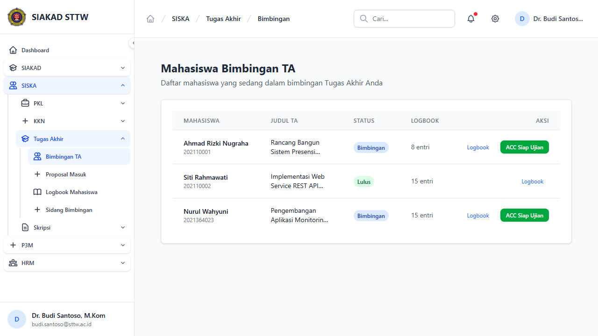
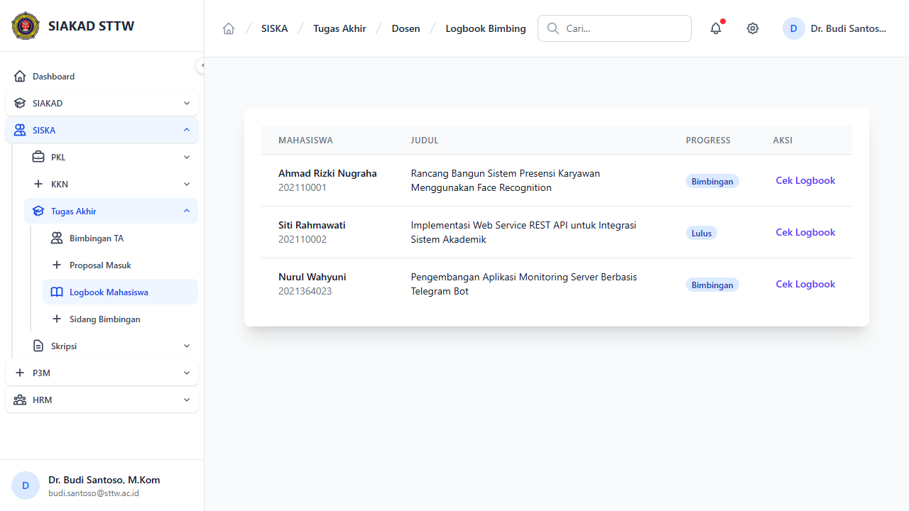
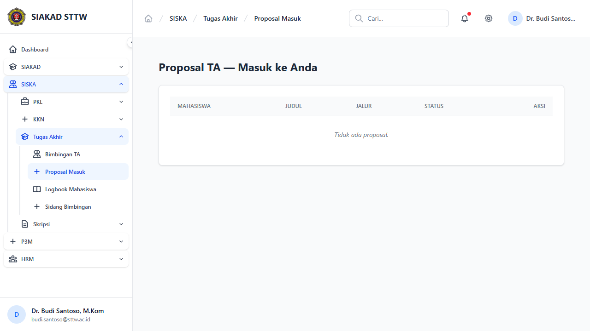
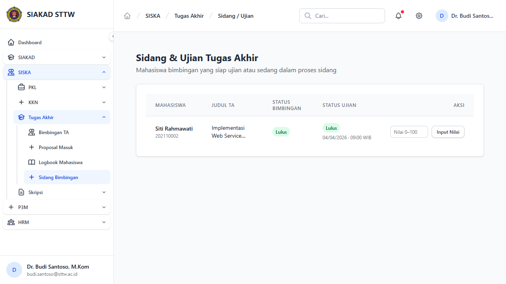
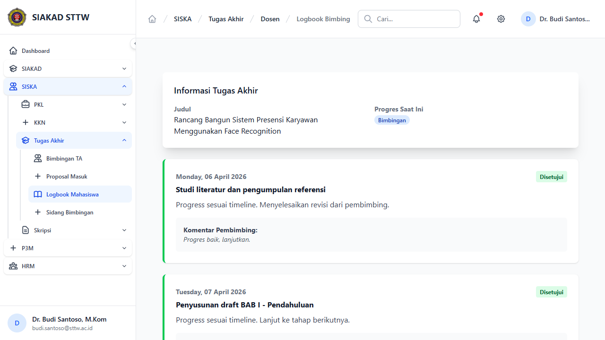

# Workflow Report: Tugas Akhir — Dosen

**Tanggal**: 2026-04-14
**Role**: Dosen (budi.santoso@sttw.ac.id — Dr. Budi Santoso, M.Kom)
**Modul**: SISKA — Tugas Akhir
**Status**: ✅ Berhasil (5/5 halaman OK)

## Ringkasan

Dokumentasi alur kerja dosen pembimbing TA. Dosen memiliki akses ke 4 menu utama: Bimbingan, Logbook Mahasiswa, Proposal Masuk, dan Sidang.

## Langkah-langkah

### 1. Bimbingan — Daftar Mahasiswa Bimbingan
**URL**: `/siska/ta/dosen/bimbingan`
**Status**: ✅ OK

Menampilkan daftar mahasiswa yang dibimbing untuk TA. Tabel: Mahasiswa, NIM, Judul, Progress, Status.

---

### 2. Logbook Mahasiswa — Daftar
**URL**: `/siska/ta/dosen/logbooks`
**Status**: ✅ OK

Menampilkan daftar mahasiswa bimbingan beserta progress logbook. Tabel: Mahasiswa, NIM, Judul, Progress. Aksi "Cek Logbook" untuk melihat detail logbook tiap mahasiswa.

---

### 3. Proposal Masuk
**URL**: `/siska/ta/dosen/proposals`
**Status**: ✅ OK

Menampilkan proposal TA yang memerlukan review dosen. Dosen dapat melihat dan memberikan feedback pada proposal mahasiswa bimbingannya.

---

### 4. Jadwal Sidang
**URL**: `/siska/ta/dosen/sidangs`
**Status**: ✅ OK

Menampilkan jadwal sidang TA dimana dosen berperan sebagai pembimbing atau penguji.

---

### 5. Logbook Detail — Cek Logbook Mahasiswa
**URL**: `/siska/ta/dosen/logbooks/{registration}`
**Status**: ✅ OK

Detail logbook mahasiswa. Menampilkan daftar entri logbook yang dikirim mahasiswa. Dosen dapat memvalidasi dan memberikan komentar pada setiap entri.

---

## Catatan

- Semua halaman dosen TA berfungsi tanpa error
- Dr. Budi Santoso memiliki 3 mahasiswa bimbingan TA
- Dosen dapat memvalidasi logbook dan mereview proposal dari halaman masing-masing
