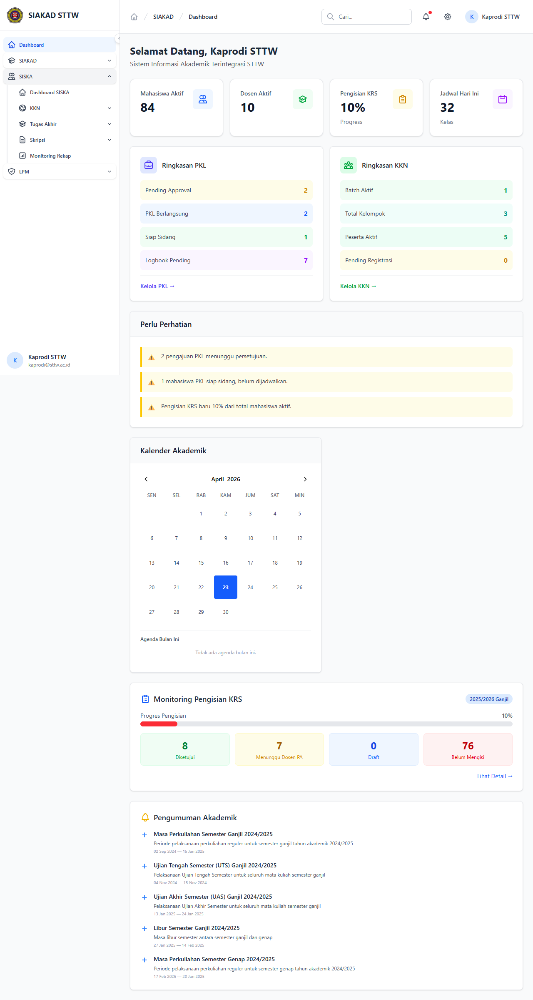
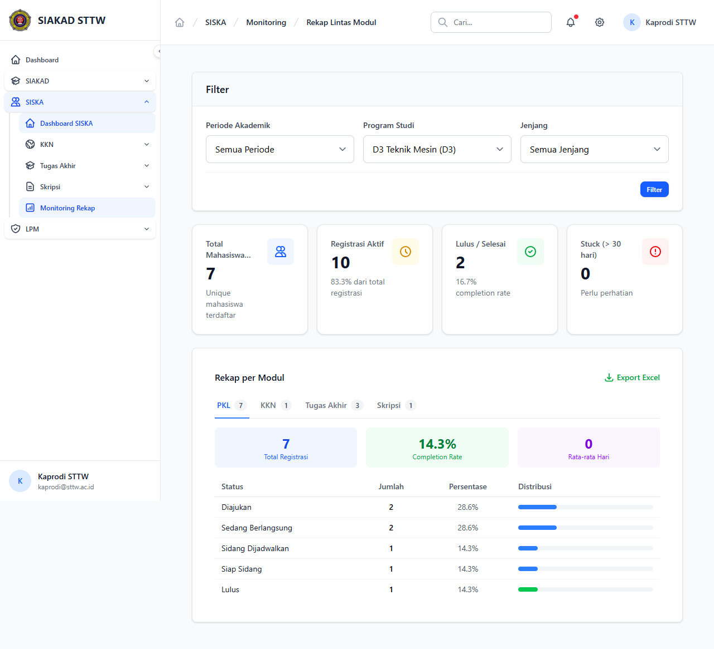

# Workflow Report: Monitoring Rekap SISKA untuk Kaprodi (Auto-Scoped per Prodi)

**Tanggal**: 2026-04-23
**Role**: kaprodi (`kaprodi@sttw.ac.id`, prodi: D3 Teknik Mesin)
**Modul**: SISKA
**Fitur**: Monitoring Rekap Lintas Modul (auto-scoped per prodi)
**Status**: ✅ Berhasil

## Deskripsi Workflow

Memverifikasi alur Monitoring Rekap SISKA untuk role **Kaprodi** setelah PR #149 (kaprodi prodi-scoped monitoring) dan PR #150 (sidebar visibility fix). Kaprodi memegang permission baru `siska.monitoring.rekap-prodi` (bukan `siska.monitoring.rekap`), sehingga:

1. Sidebar harus menampilkan menu **Dashboard SISKA** dan **Monitoring Rekap** di grup *SISKA*.
2. Halaman rekap hanya menghitung mahasiswa dari prodi kaprodi.
3. Drill-down per modul (PKL/KKN/Skripsi/TA) tetap auto-scoped.

## Ringkasan

- ✅ Sidebar grup **SISKA** menampilkan **Dashboard SISKA** dan **Monitoring Rekap** untuk kaprodi.
- ✅ Halaman index `siska.monitoring.rekap.index` memuat statistik agregat hanya untuk prodi D3 Teknik Mesin.
- ✅ Dropdown filter *Program Studi* preselected `D3 Teknik Mesin (D3)` dan tidak dapat memilih prodi lain.
- ✅ Drill-down **PKL** menampilkan daftar peserta PKL dari prodi kaprodi saja.

## Langkah-langkah

### 1. Buka Sidebar Grup SISKA

**Deskripsi**: Klik header **SISKA** di sidebar untuk meng-expand. Tampak item **Dashboard SISKA** di paling atas dan **Monitoring Rekap** di akhir grup. Sebelum PR #150, kedua item ini tidak terlihat untuk kaprodi karena permission gating hanya cek `siska.monitoring.rekap`.

**URL**: `http://127.0.0.1:8000/dashboard`

### 2. Halaman Index Monitoring Rekap (Auto-Scoped)

**Deskripsi**: Klik **Monitoring Rekap**. Halaman menampilkan rekap lintas modul SISKA (PKL, KKN, Skripsi, TA, dll) khusus untuk mahasiswa prodi D3 Teknik Mesin. Filter *Program Studi* otomatis diset ke `D3 Teknik Mesin (D3)` dan dropdown tidak menyediakan opsi prodi lain. Statistik teratas: Total Mahasiswa SISKA, total registrasi (83.3% dari total mahasiswa prodi).

**URL**: `http://127.0.0.1:8000/siska/monitoring/rekap`

### 3. Drill-down per Modul: PKL

**Deskripsi**: Klik tombol **PKL (7)** di section *Rekap per Modul*. Halaman PKL menampilkan daftar 7 peserta PKL dari prodi D3 Teknik Mesin saja. Konsistensi scope dijaga di semua link drill-down.

**URL**: `http://127.0.0.1:8000/siska/monitoring/rekap` (modal/section PKL)

## Temuan & Masalah

| # | Halaman | URL | Kategori | Deskripsi | Screenshot | Prioritas |
|---|---------|-----|----------|-----------|------------|-----------|
| — | — | — | — | Tidak ada temuan baru. Sebelum PR #150, sidebar **Dashboard SISKA** dan **Monitoring Rekap** tidak muncul untuk kaprodi (kategori `missing-sidebar`). Sudah diperbaiki di PR #150 dan diverifikasi di laporan ini. | — | — |

## Catatan

- Data prep: user `kaprodi@sttw.ac.id` di-link ke `program_studi_id=1` (D3 Teknik Mesin) lewat tinker.
- PR #150 (`dev/2026-04-23-kaprodi-sidebar-monitoring`) memperbaiki sidebar visibility: grup SISKA dan item *Dashboard SISKA* + *Monitoring Rekap* sekarang menerima permission `siska.monitoring.rekap-prodi`.
- Test regression: `tests/Feature/Kaprodi/MonitoringScopeTest.php` (12 test, 21 assertion, semua passed).
- Export: tombol *Export* tersedia di index. Tidak di-screenshot (memicu download). Sudah dicover di backend lewat `siska.monitoring.export-prodi` permission.
