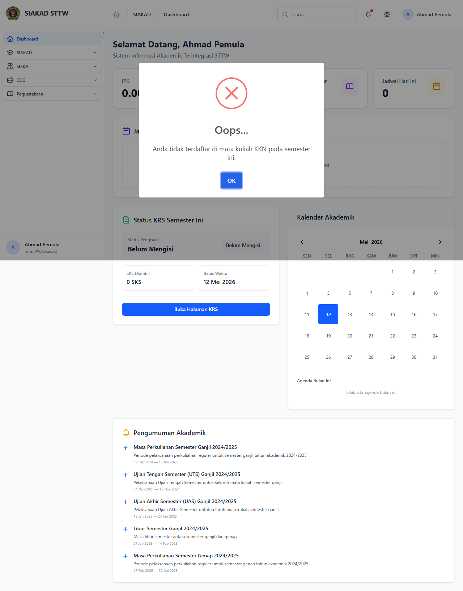

# Workflow Report: Logbook KKN Mahasiswa

**Tanggal**: 2026-05-12
**Role**: mahasiswa (mhs1@sttw.ac.id)
**Modul**: siska
**Fitur**: mahasiswa-kkn-logbook
**Status**: ⚠️ Partial

## Deskripsi Workflow

Logbook KKN diblokir karena tidak eligible.

## Ringkasan

Halaman diakses sebagai mahasiswa pada delta scan pertengahan April 2026.

## Langkah-langkah

### 1. Buka halaman Logbook KKN Mahasiswa

**Deskripsi**: Mahasiswa membuka halaman `/siska/kkn/mahasiswa/logbook` melalui sidebar / navigasi bawaan SIAKAD.

**URL**: `http://127.0.0.1:8000/siska/kkn/mahasiswa/logbook`

## Temuan & Masalah

| # | Halaman | URL | Kategori | Deskripsi | Screenshot | Prioritas |
|---|---------|-----|----------|-----------|------------|-----------|
| 1 | Logbook KKN Mahasiswa | /siska/kkn/mahasiswa/logbook | permission | Mahasiswa mhs1 tidak memiliki mata kuliah terkait di KRS aktif sehingga middleware siska.eligible me-redirect ke dashboard |  | Low |

## Catatan

- Diambil otomatis pada batch scan delta pertengahan April 2026.
- Full-page screenshot.
