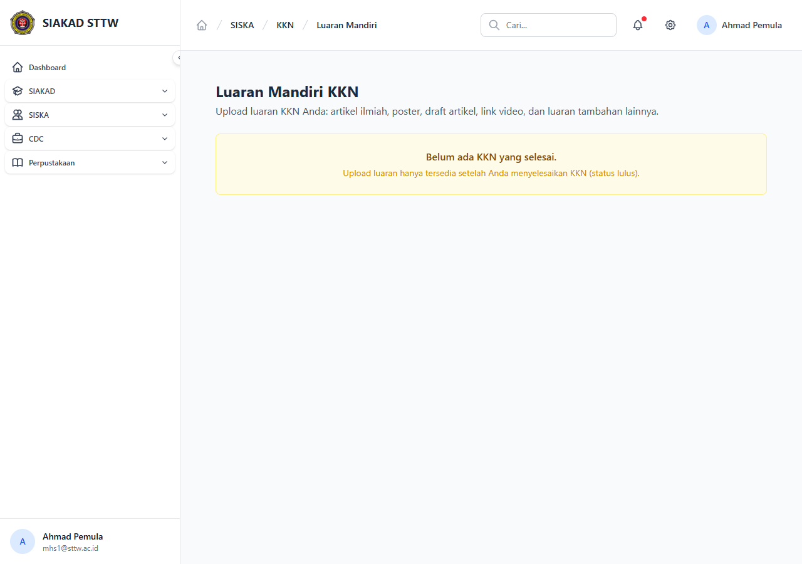

# Workflow Report: KKN — Luaran Mandiri (Mahasiswa)

**Tanggal**: 2026-05-12
**Role**: Mahasiswa (mhs1@sttw.ac.id)
**Modul**: SISKA — KKN
**Fitur**: Upload Luaran Mandiri (di luar kelompok)
**Status**: ✅ Berhasil (load OK; upload form available)

## Deskripsi Workflow

Mahasiswa peserta KKN dapat mengunggah **luaran mandiri** (artefak hasil KKN yang dilakukan secara individual, di luar luaran kelompok). Surface ini ditambahkan via commit `feat(kkn): add luaran mandiri upload menu` (#189) sebagai komplemen dari luaran kelompok yang dikelola DPL. Workflow ini memverifikasi halaman dapat diakses mahasiswa dan form upload tersedia.

## Ringkasan

- Halaman `/siska/kkn/luaran-mandiri` load 200 OK dengan title "Luaran Mandiri KKN".
- Tersedia form upload + tabel daftar luaran mandiri yang sudah diunggah.
- Eligibility: hanya mahasiswa yang punya KKN aktif di KRS yang bisa akses.

## Langkah-langkah

### 1. Halaman Luaran Mandiri KKN (Mahasiswa)

**Deskripsi**: Akses `/siska/kkn/luaran-mandiri` dari sidebar SISKA → KKN → Luaran Mandiri. Halaman menampilkan form upload (judul, jenis luaran, file) serta daftar luaran mandiri yang pernah diunggah mahasiswa tersebut.

**URL**: `http://127.0.0.1:8000/siska/kkn/luaran-mandiri`

## Temuan & Masalah

| # | Halaman | URL | Kategori | Deskripsi | Screenshot | Prioritas |
|---|---------|-----|----------|-----------|------------|-----------|
| - | - | - | - | Halaman load OK; tidak ada masalah teknis terdeteksi. Dummy upload tidak diuji (tidak ada file fixture pada session). | - | - |

## Catatan

- Source commit: `feat(kkn): add luaran mandiri upload menu` (#189).
- Komplemen dari luaran KKN kelompok (dikelola DPL di `siska/dosen-kkn-luaran/`).
- Eligibility dijaga middleware `siska.eligible:kkn` (mahasiswa harus punya KKN di KRS aktif).
