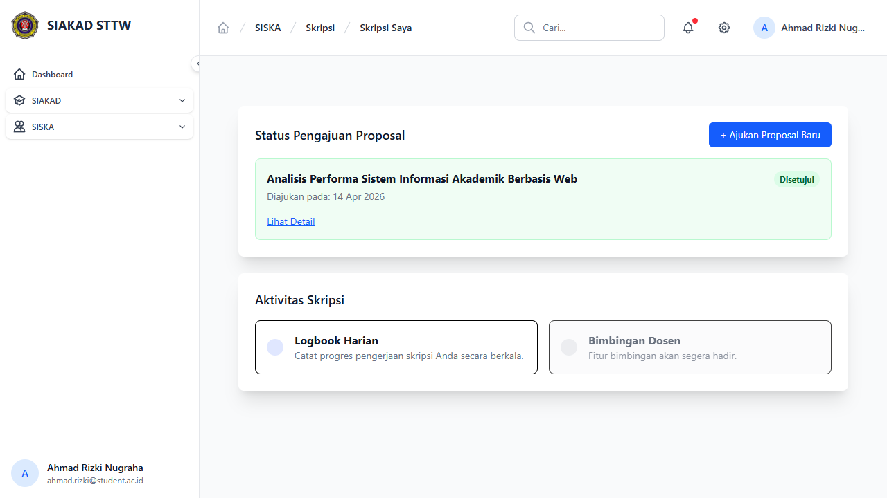
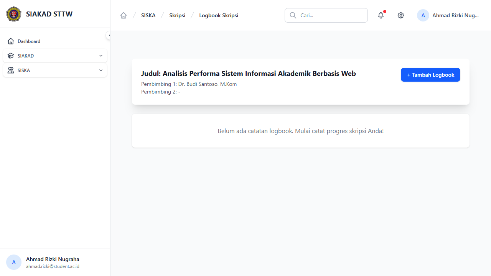
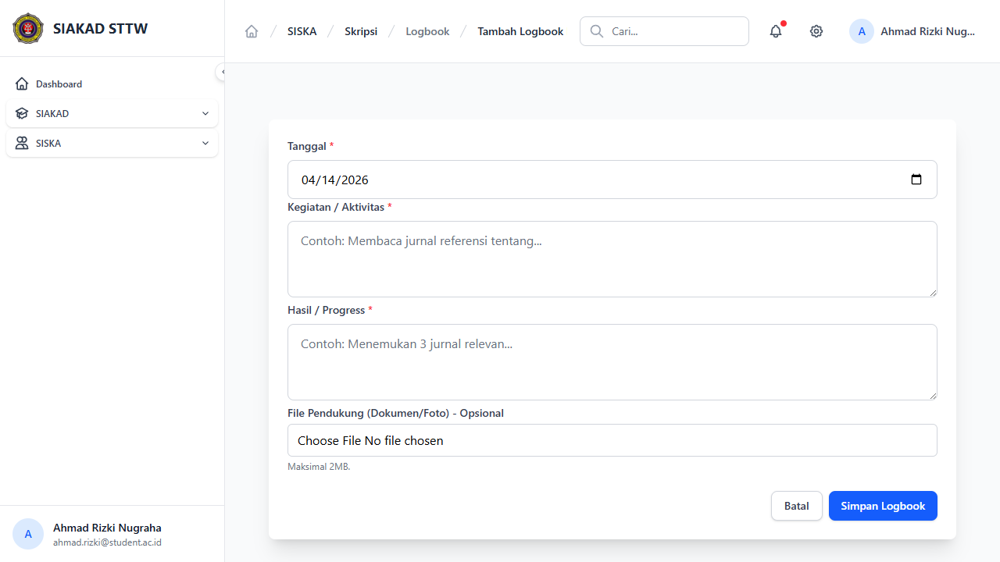
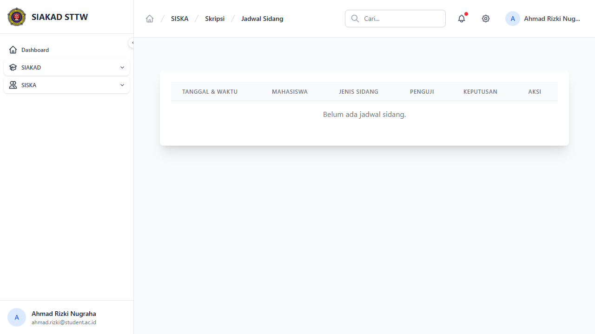
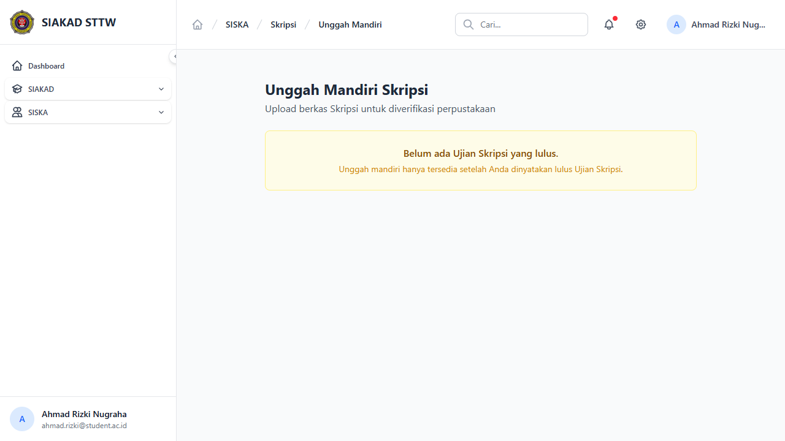
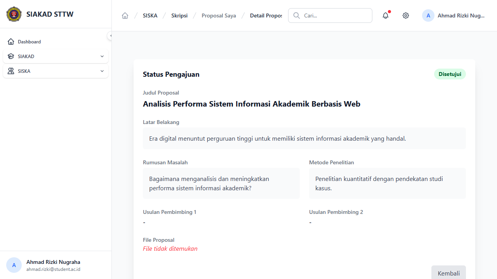

# Workflow Report: Skripsi — Mahasiswa

**Tanggal**: 2026-04-14
**Role**: Mahasiswa (ahmad.rizki@student.ac.id — Ahmad Rizki Nugraha, 202110001)
**Modul**: SISKA — Skripsi
**Status**: ✅ Berhasil (6/6 halaman OK)

## Ringkasan

Dokumentasi alur kerja mahasiswa dalam modul Skripsi. Mahasiswa dapat mengajukan proposal, mengisi logbook bimbingan, melihat jadwal sidang, dan mengunggah berkas mandiri. Akses memerlukan mata kuliah "Skripsi" dalam KRS yang disetujui.

## Langkah-langkah

### 1. Daftar Proposal
**URL**: `/siska/skripsi/proposals`
**Status**: ✅ OK

Menampilkan daftar proposal skripsi milik mahasiswa. Ahmad memiliki 1 proposal dengan status "Disetujui". Tombol "+ Ajukan Proposal Baru" dan "Lihat Detail" tersedia.

---

### 2. Logbook Bimbingan — Daftar
**URL**: `/siska/skripsi/logbooks`
**Status**: ✅ OK

Daftar logbook bimbingan skripsi. Tabel: No, Tanggal, Kegiatan, Status Validasi, Komentar Dosen, Aksi. Tombol "Tambah Logbook" tersedia.

---

### 3. Tambah Logbook Bimbingan
**URL**: `/siska/skripsi/logbooks/create`
**Status**: ✅ OK

Form input logbook bimbingan baru:
- **Tanggal**: Date picker
- **Kegiatan**: Textarea deskripsi kegiatan
- **File Pendukung**: Upload lampiran (opsional)

---

### 4. Jadwal Sidang
**URL**: `/siska/skripsi/sidangs`
**Status**: ✅ OK

Jadwal sidang skripsi mahasiswa. Informasi: tanggal, ruangan, penguji, status.

---

### 5. Unggah Mandiri
**URL**: `/siska/skripsi/unggah-mandiri`
**Status**: ✅ OK

Unggah berkas skripsi mandiri untuk perpustakaan. Mahasiswa lulus sidang dapat mengunggah file laporan final.

---

### 6. Detail Proposal
**URL**: `/siska/skripsi/proposals/{id}`
**Status**: ✅ OK

Detail proposal skripsi. Menampilkan judul, abstrak, dosen pembimbing, status approval, dan riwayat revisi.

---

## Catatan

- Semua halaman mahasiswa Skripsi berfungsi tanpa error
- Akses memerlukan mata kuliah "Skripsi" di KRS aktif (Disetujui)
- Ahmad memiliki 1 proposal skripsi (Disetujui) dan registrasi berstatus "bimbingan"
