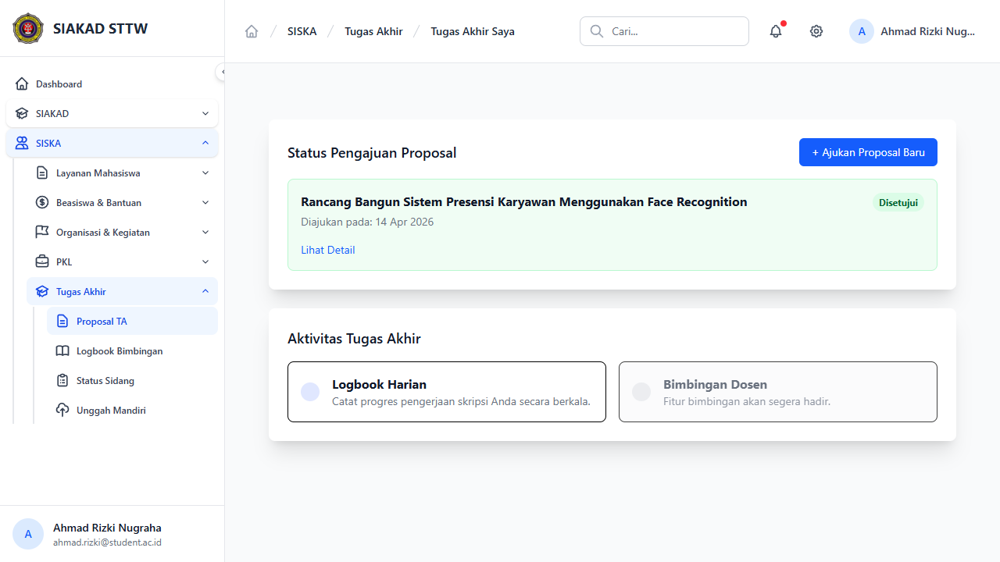
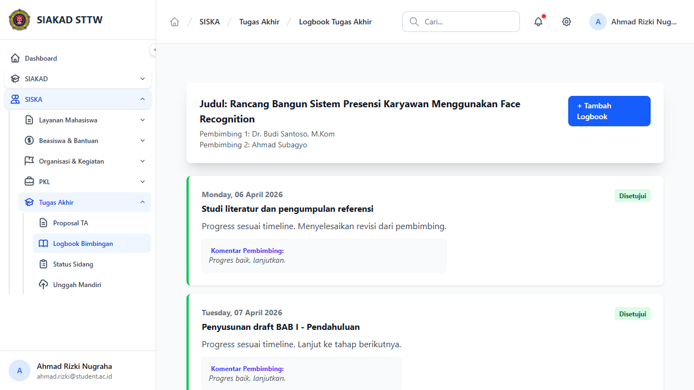
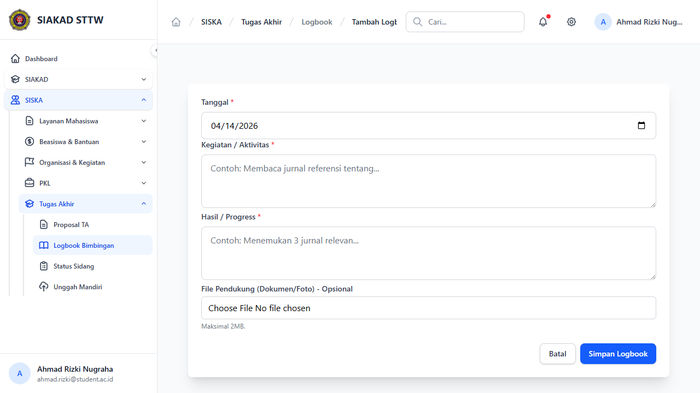
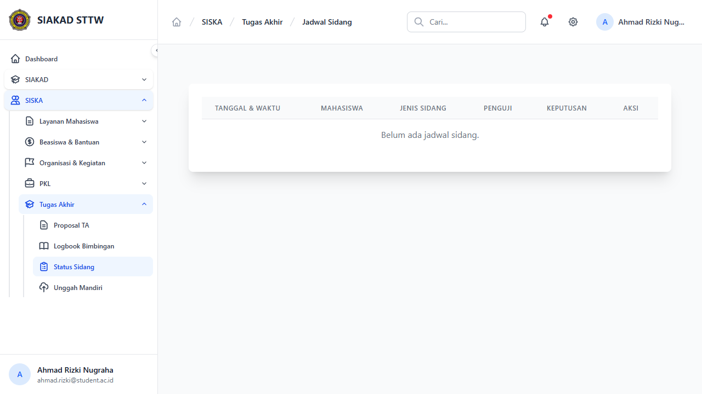
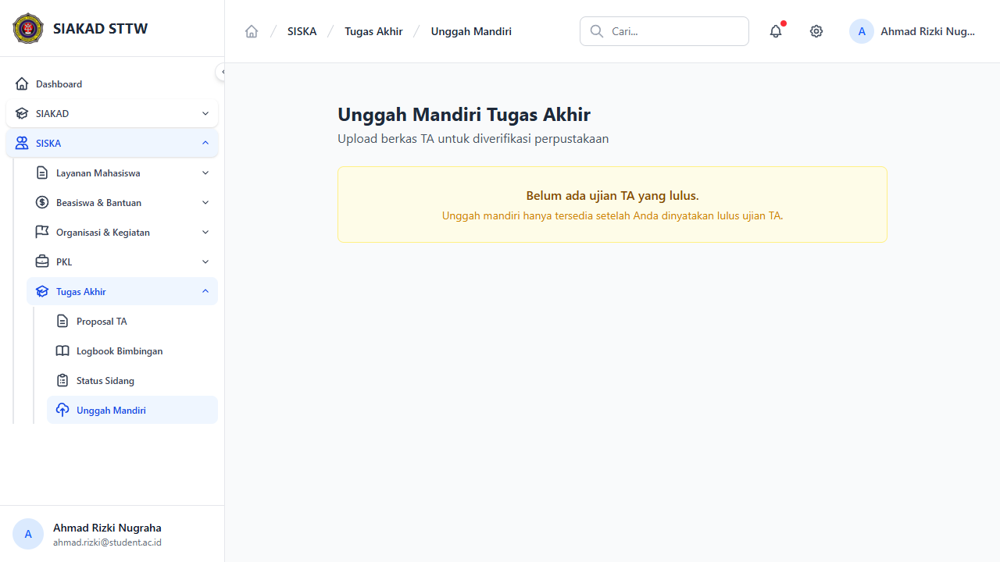
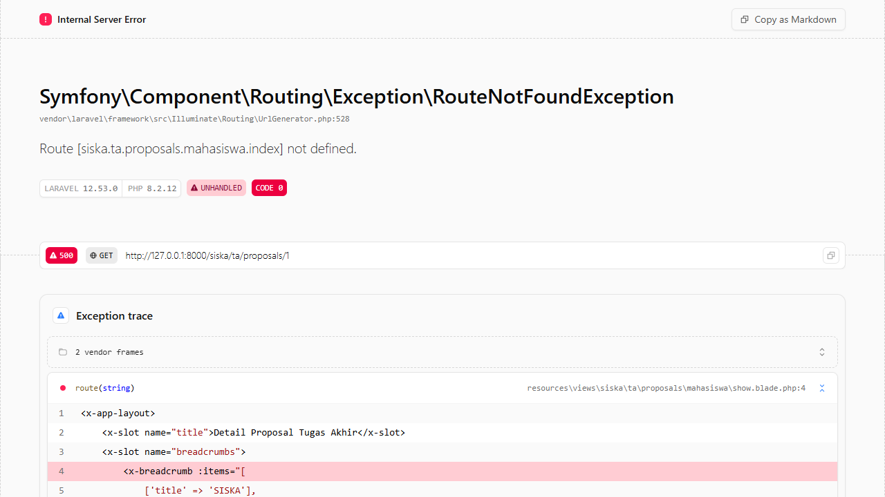

# Workflow Report: Tugas Akhir — Mahasiswa

**Tanggal**: 2026-04-14
**Role**: Mahasiswa (ahmad.rizki@student.ac.id — Ahmad Rizki Nugraha, 202110001)
**Modul**: SISKA — Tugas Akhir
**Status**: ✅ Berhasil (6/6 halaman OK)

## Ringkasan

Dokumentasi alur kerja mahasiswa dalam modul Tugas Akhir. Mahasiswa dapat mengajukan proposal, mengisi logbook bimbingan, melihat jadwal sidang, dan mengunggah berkas mandiri. Akses ke modul ini memerlukan mata kuliah "Tugas Akhir" dalam KRS yang disetujui.

## Langkah-langkah

### 1. Daftar Proposal
**URL**: `/siska/ta/proposals`
**Status**: ✅ OK

Menampilkan daftar proposal TA milik mahasiswa. Ahmad memiliki 1 proposal dengan status "Disetujui". Tombol "+ Ajukan Proposal Baru" tersedia di kanan atas. Link "Lihat Detail" mengarah ke halaman detail proposal.

---

### 2. Logbook Bimbingan — Daftar
**URL**: `/siska/ta/logbooks`
**Status**: ✅ OK

Menampilkan daftar logbook bimbingan TA yang sudah dikirim. Tabel: No, Tanggal, Kegiatan, Status Validasi, Komentar Dosen, Aksi. Tombol "Tambah Logbook" untuk menambah entri baru.

---

### 3. Tambah Logbook Bimbingan
**URL**: `/siska/ta/logbooks/create`
**Status**: ✅ OK

Form input logbook bimbingan baru. Field yang tersedia:
- **Tanggal**: Date picker
- **Kegiatan**: Textarea deskripsi kegiatan bimbingan
- **File Pendukung**: Upload file lampiran (opsional)

---

### 4. Jadwal Sidang
**URL**: `/siska/ta/sidangs`
**Status**: ✅ OK

Menampilkan jadwal sidang TA mahasiswa. Informasi sidang meliputi tanggal, ruangan, dosen penguji, dan status.

---

### 5. Unggah Mandiri
**URL**: `/siska/ta/unggah-mandiri`
**Status**: ✅ OK

Halaman unggah berkas TA mandiri untuk perpustakaan. Mahasiswa yang sudah lulus sidang dapat mengunggah file laporan TA final.

---

### 6. Detail Proposal
**URL**: `/siska/ta/proposals/{id}`
**Status**: ✅ OK

Detail proposal TA yang sudah diajukan. Menampilkan judul, abstrak, dosen pembimbing, status approval, dan riwayat revisi jika ada.

---

## Catatan

- Semua halaman mahasiswa TA berfungsi tanpa error
- Akses memerlukan mata kuliah "Tugas Akhir" di KRS aktif (status Disetujui)
- Ahmad memiliki 1 proposal TA dengan status "Disetujui"
- Registrasi TA Ahmad berstatus "bimbingan"
