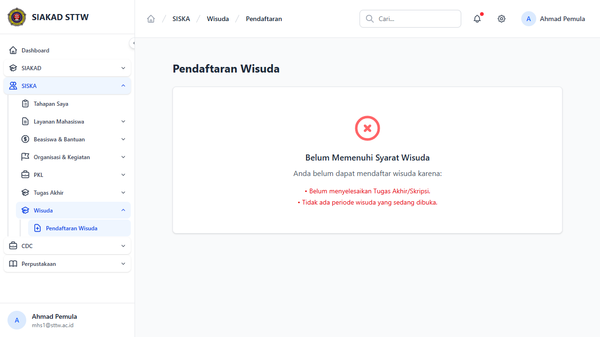

# Workflow Report: Pendaftaran Wisuda

**Tanggal**: 2026-05-12
**Role**: mahasiswa (mhs1@sttw.ac.id)
**Modul**: siska
**Fitur**: mahasiswa-wisuda-pendaftaran
**Status**: ✅ Berhasil

## Deskripsi Workflow

Halaman pendaftaran wisuda mahasiswa.

## Ringkasan

Halaman diakses sebagai mahasiswa pada delta scan pertengahan April 2026.

## Langkah-langkah

### 1. Buka halaman Pendaftaran Wisuda

**Deskripsi**: Mahasiswa membuka halaman `/siska/wisuda/pendaftaran` melalui sidebar / navigasi bawaan SIAKAD.

**URL**: `http://127.0.0.1:8000/siska/wisuda/pendaftaran`

## Temuan & Masalah

_Tidak ada temuan signifikan._

## Catatan

- Diambil otomatis pada batch scan delta pertengahan April 2026.
- Full-page screenshot.
