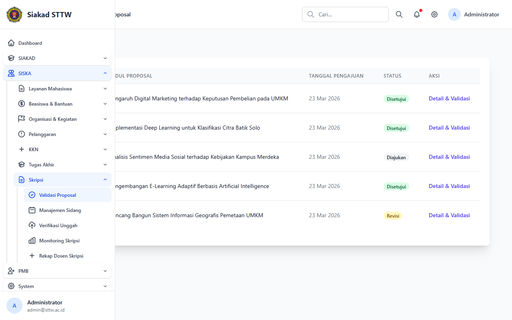
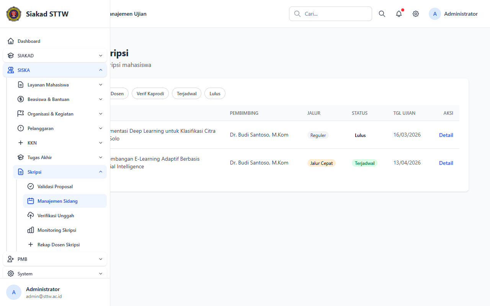
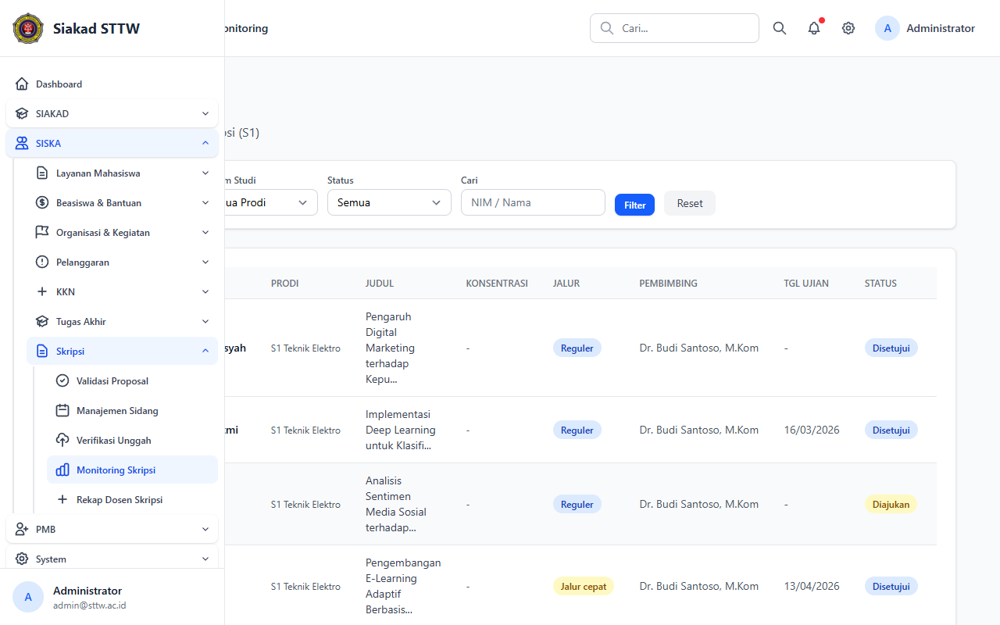
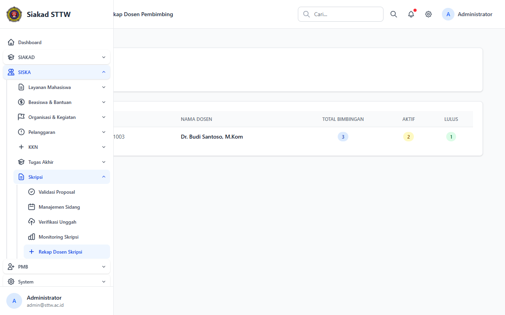

# Skripsi — Administrator

> Direkam: 2026-03-25  
> Role: **Administrator (admin@sttw.ac.id)**  
> Modul: **Skripsi**  
> Status: ✅ Berhasil

## Ringkasan

Workflow Skripsi dari sisi administrator. Menampilkan manajemen proposal, jadwal ujian, monitoring progress, dan rekap beban bimbingan dosen.

## Halaman

| # | Halaman | URL | Status |
|---|---------|-----|--------|
| 01 | Daftar Proposal Skripsi | `/siska/skripsi/proposals-admin` | ✅ OK |
| 02 | Daftar Ujian Skripsi | `/siska/skripsi/admin/ujians` | ✅ OK |
| 03 | Monitoring Skripsi | `/siska/skripsi/monitoring` | ✅ OK |
| 04 | Rekap Dosen Skripsi | `/siska/skripsi/rekap-dosen` | ✅ OK |

## Screenshots

### 1. Daftar Proposal Skripsi

Semua proposal skripsi mahasiswa beserta statusnya.

### 2. Daftar Ujian Skripsi

Jadwal dan status ujian skripsi.

### 3. Monitoring Skripsi

Dashboard monitoring progress skripsi keseluruhan.

### 4. Rekap Dosen Pembimbing Skripsi

Rekap beban bimbingan per dosen.

