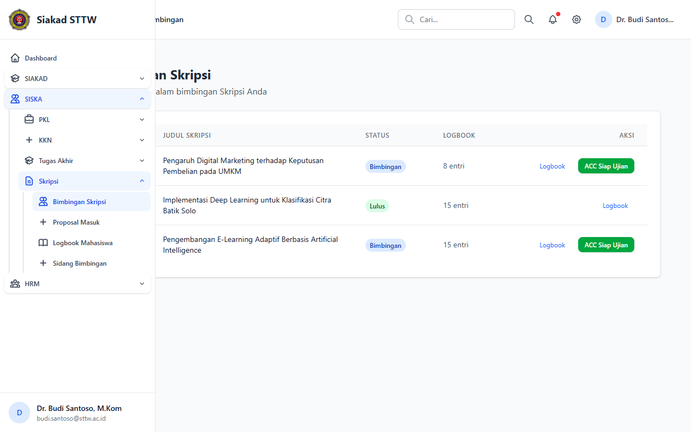
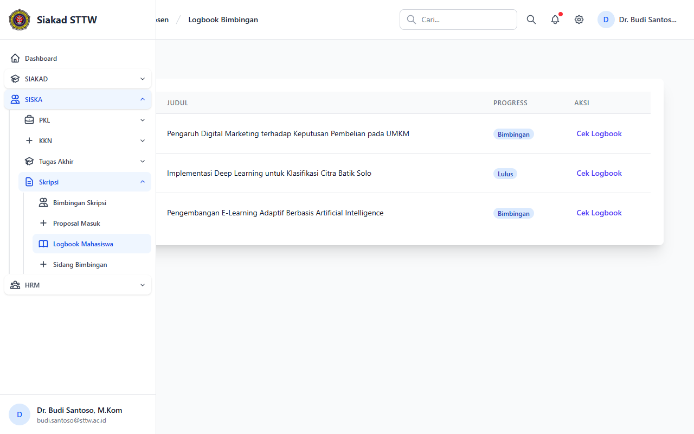
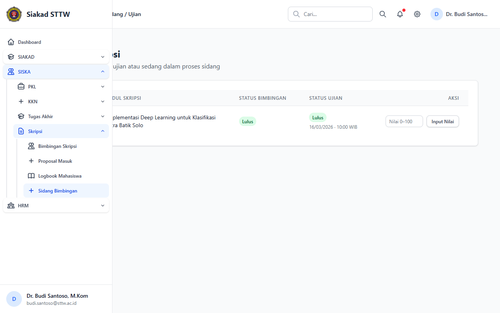
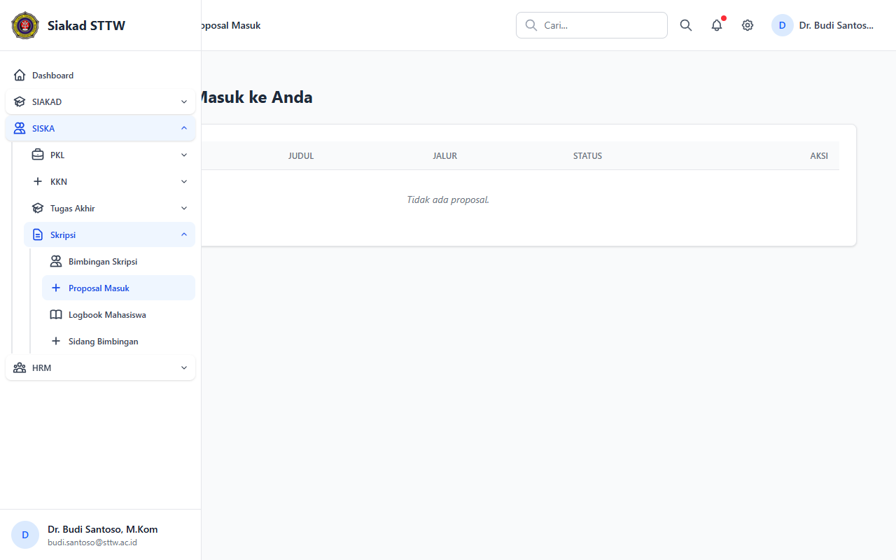

# Skripsi — Dosen (Dr. Budi Santoso, M.Kom)

> Direkam: 2026-03-25  
> Role: **Dosen (budi.santoso@sttw.ac.id)**  
> Modul: **Skripsi**  
> Status: ✅ Berhasil

## Ringkasan

Workflow Skripsi dari sisi dosen pembimbing. Menampilkan daftar mahasiswa bimbingan, logbook bimbingan, jadwal sidang, dan proposal yang perlu ditinjau.

## Halaman

| # | Halaman | URL | Status |
|---|---------|-----|--------|
| 01 | Bimbingan Skripsi | `/siska/skripsi/dosen/bimbingan` | ✅ OK |
| 02 | Logbook Bimbingan Skripsi | `/siska/skripsi/dosen/logbooks` | ✅ OK |
| 03 | Sidang Skripsi | `/siska/skripsi/dosen/sidangs` | ✅ OK |
| 04 | Usulan Proposal Skripsi | `/siska/skripsi/dosen/proposals` | ✅ OK |

## Screenshots

### 1. Bimbingan Skripsi

Daftar mahasiswa bimbingan skripsi.

### 2. Logbook Bimbingan Skripsi

Catatan bimbingan mahasiswa skripsi.

### 3. Sidang Skripsi — Dosen

Daftar jadwal sidang skripsi.

### 4. Usulan Proposal Skripsi

Daftar proposal yang perlu ditinjau.

