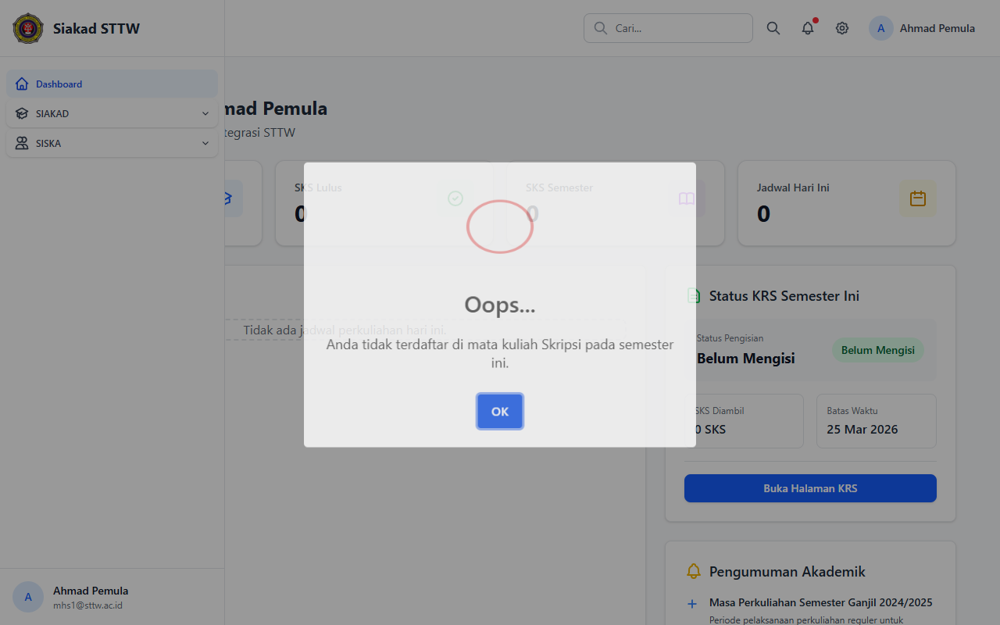

# Skripsi — Mahasiswa (Ahmad Pemula)

> Direkam: 2026-03-25  
> Role: **Mahasiswa (mhs1@sttw.ac.id)**  
> Modul: **Skripsi**  
> Status: ⚠️ Tidak Eligible

## Ringkasan

Workflow Skripsi dari sisi mahasiswa. Mahasiswa tidak dapat mengakses modul Skripsi karena belum memiliki KRS yang disetujui untuk mata kuliah Skripsi. Middleware `EnsureSiskaEligible` mencegah akses.

## Halaman

| # | Halaman | URL | Status |
|---|---------|-----|--------|
| 01 | Cek Eligibilitas Skripsi | `/siska/skripsi` | ⚠️ Tidak Eligible |

## Screenshots

### 1. Cek Eligibilitas Skripsi

Muncul dialog eligibilitas Skripsi yang mencegah mahasiswa mengakses fitur Skripsi.

## Catatan

- Mahasiswa ini belum memiliki KRS yang disetujui untuk mata kuliah Skripsi
- Middleware `EnsureSiskaEligible` mencegah akses
