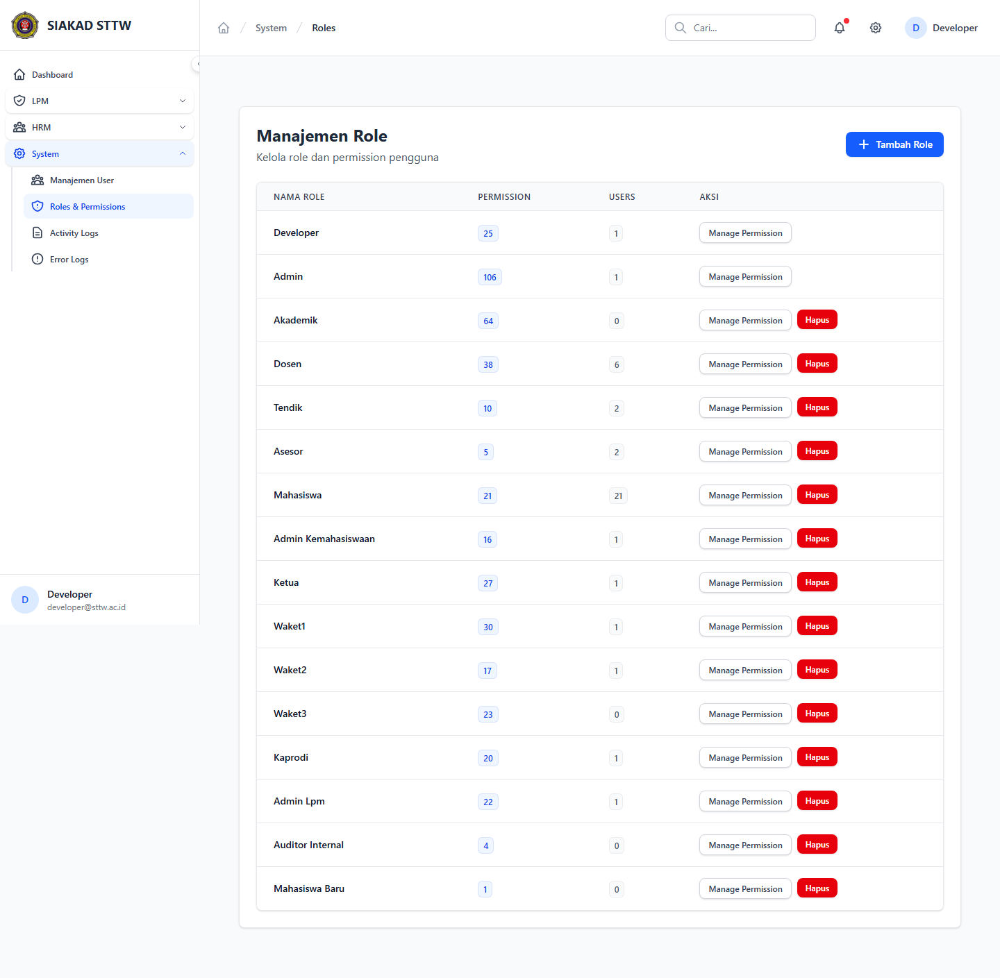
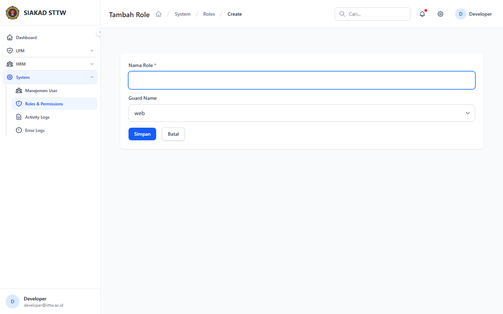
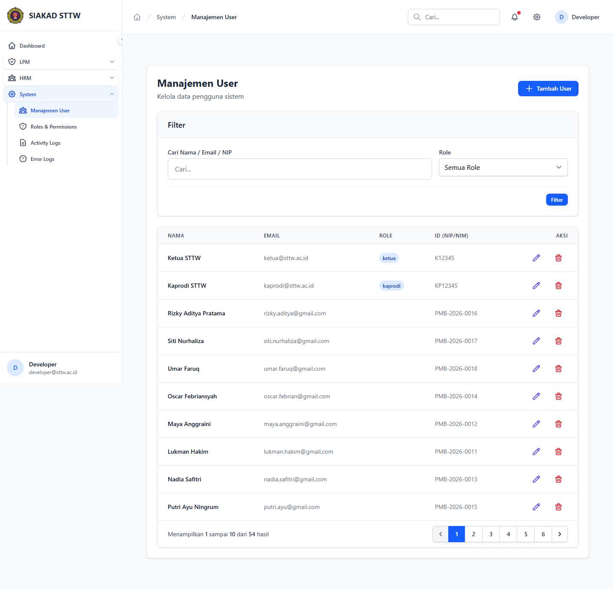
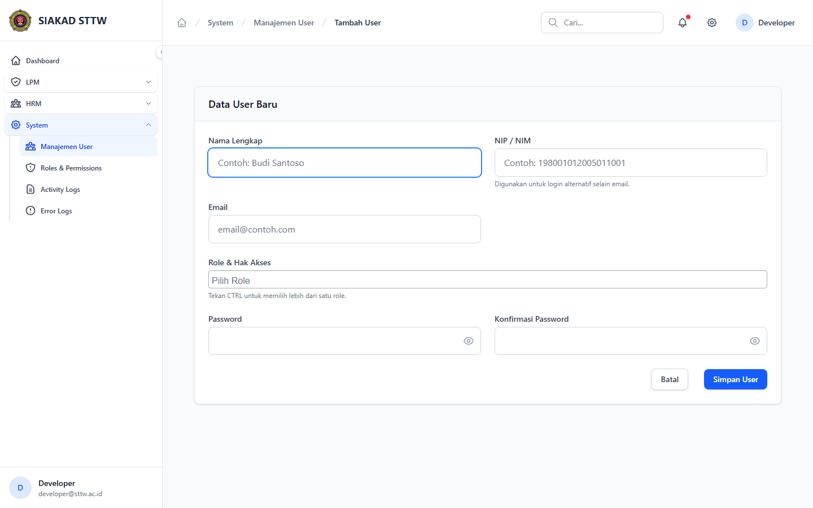
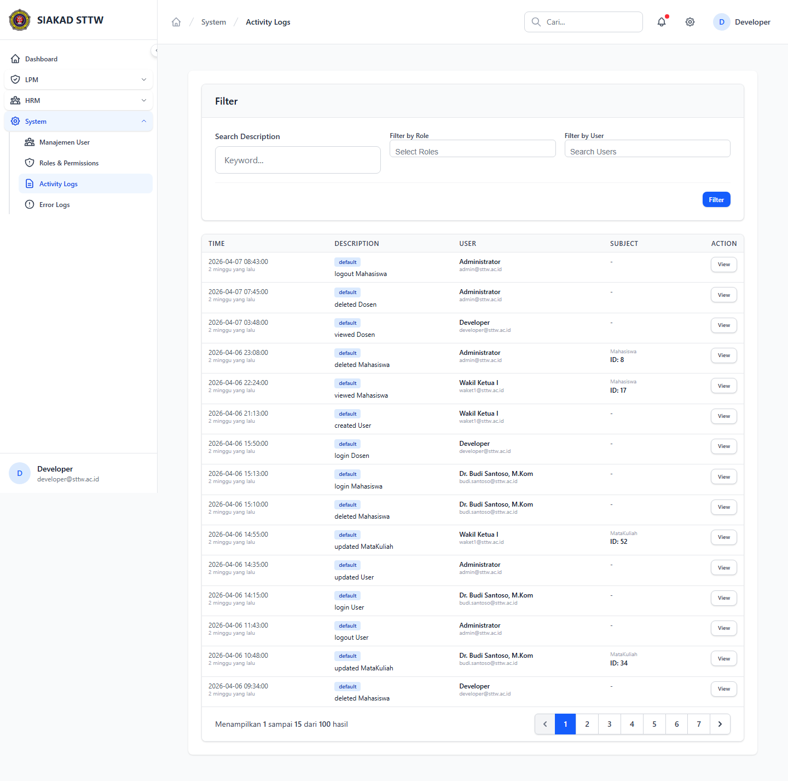
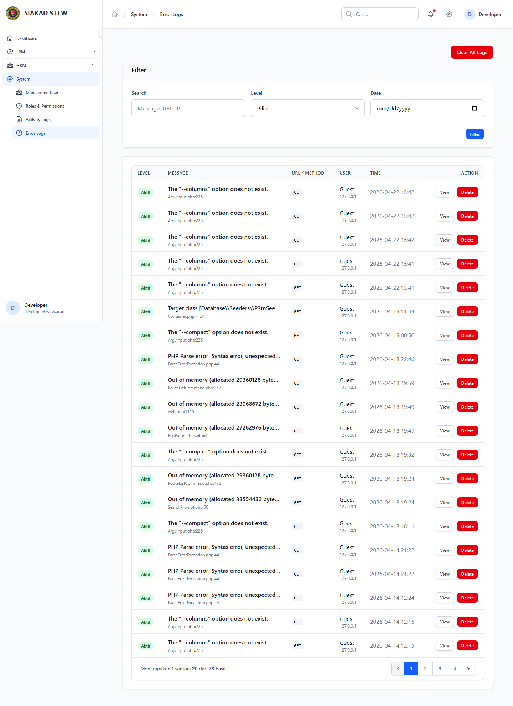

# System — Admin System (Developer)

- **Tanggal:** 2026-04-22
- **Role:** developer (`developer@sttw.ac.id`)
- **Modul:** System Admin (Users, Roles, Logs)
- **Status:** ✅ Pass — semua halaman 200

## Ringkasan

Scan area system admin: manajemen role/permission, manajemen user, activity logs, dan error logs. Semua halaman render tanpa error.

## Halaman

| # | Halaman | URL | Status |
|---|---|---|---|
| 1 | Roles — Index | `/system/roles` | 200 |
| 2 | Roles — Create | `/system/roles/create` | 200 |
| 3 | Users — Index | `/system/users` | 200 |
| 4 | Users — Create | `/system/users/create` | 200 |
| 5 | Activity Logs — Index | `/system/activity-logs` | 200 |
| 6 | Error Logs — Index | `/system/error-logs` | 200 |

## Screenshots

### 03 Roles Index

### 04 Roles Create

### 05 Users Index

### 06 Users Create

### 07 Activity Logs

### 08 Error Logs

## Temuan & Masalah

Tidak ditemukan masalah pada modul System Admin saat scan ini.

## Catatan Skenario

- Login developer menampilkan menu System di sidebar.
- Halaman Activity Logs & Error Logs menampilkan tabel kosong/sample — recommend untuk uji performa pagination saat data > 100k baris di iterasi berikutnya.
