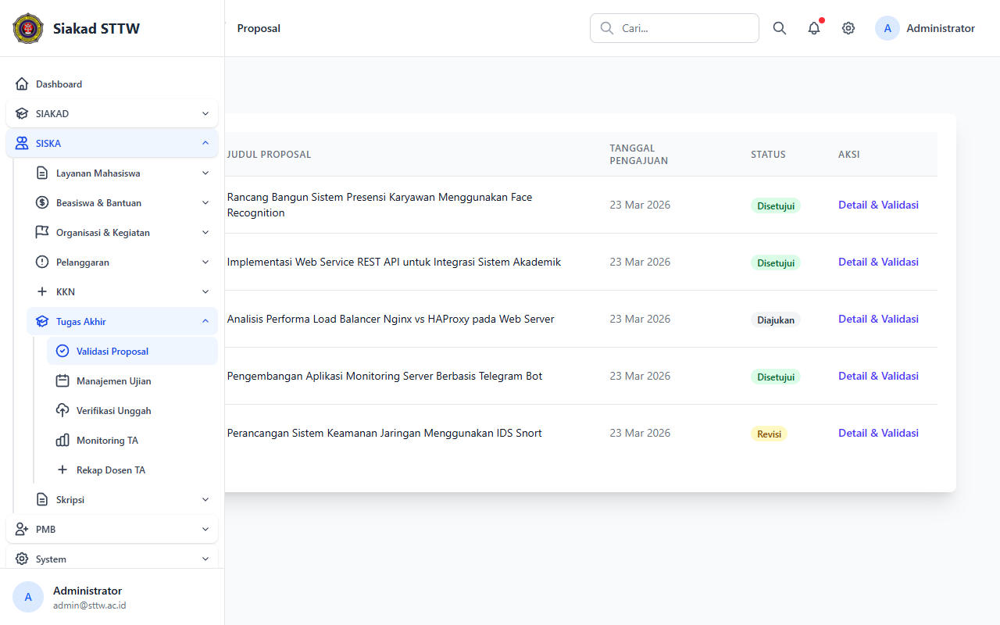
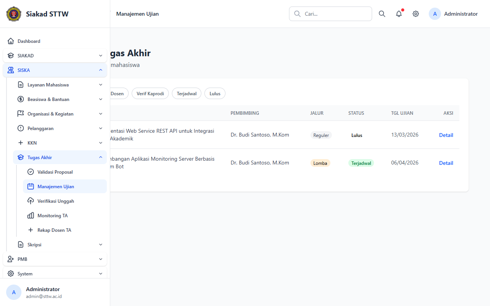
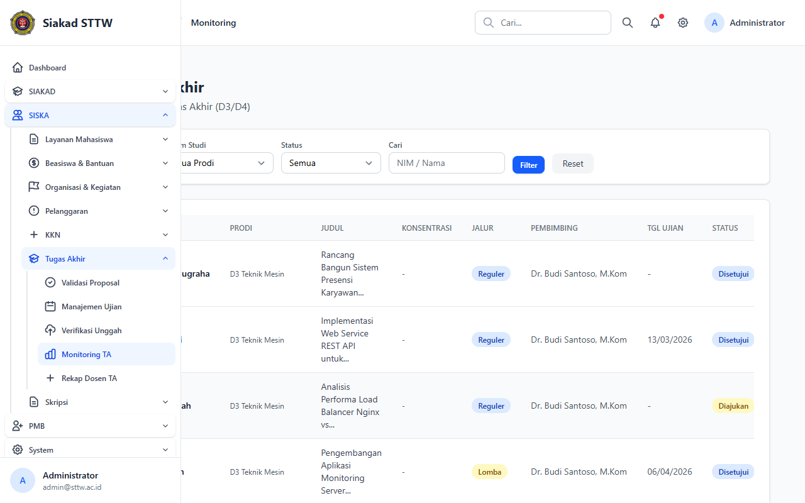
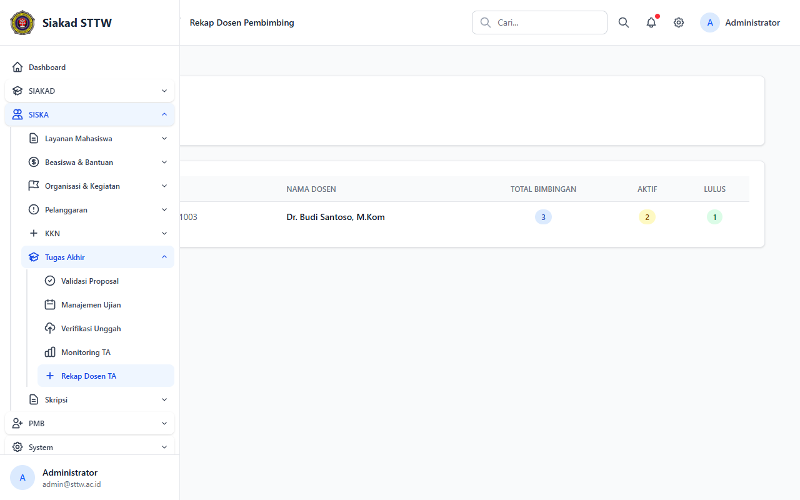

# TA — Administrator

> Direkam: 2026-03-25  
> Role: **Administrator (admin@sttw.ac.id)**  
> Modul: **TA (Tugas Akhir)**  
> Status: ✅ Berhasil

## Ringkasan

Workflow Tugas Akhir dari sisi administrator. Menampilkan manajemen proposal, jadwal ujian, monitoring progress, dan rekap beban bimbingan dosen.

## Halaman

| # | Halaman | URL | Status |
|---|---------|-----|--------|
| 01 | Daftar Proposal TA | `/siska/ta/proposals-admin` | ✅ OK |
| 02 | Daftar Ujian TA | `/siska/ta/admin/ujians` | ✅ OK |
| 03 | Monitoring TA | `/siska/ta/monitoring` | ✅ OK |
| 04 | Rekap Dosen TA | `/siska/ta/rekap-dosen` | ✅ OK |

## Screenshots

### 1. Daftar Proposal Tugas Akhir

Semua proposal TA mahasiswa beserta statusnya.

### 2. Daftar Ujian TA

Jadwal dan status ujian TA.

### 3. Monitoring Tugas Akhir

Dashboard monitoring progress TA keseluruhan.

### 4. Rekap Dosen Pembimbing TA

Rekap beban bimbingan per dosen.

