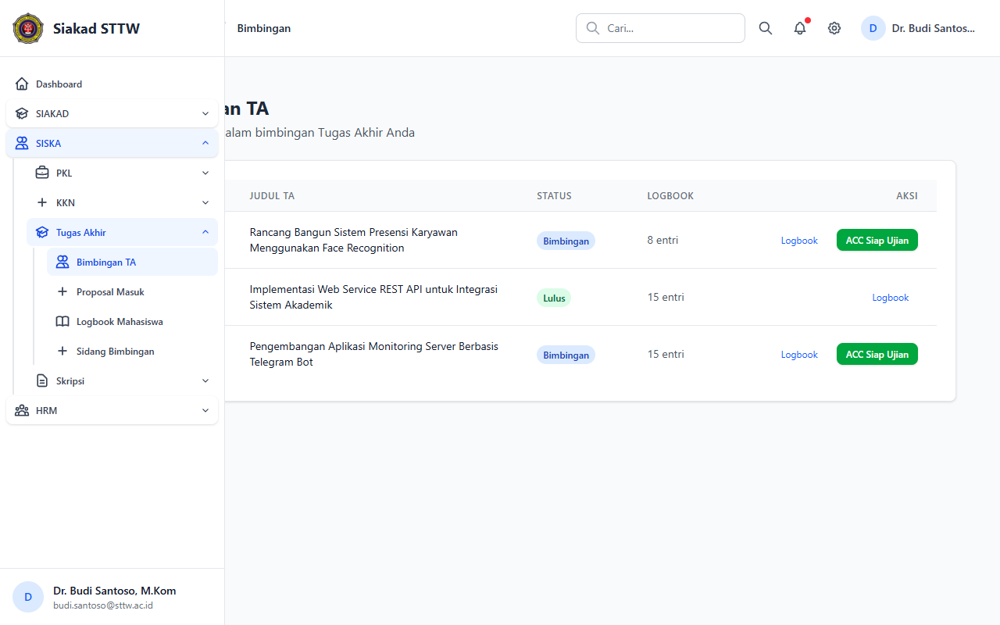
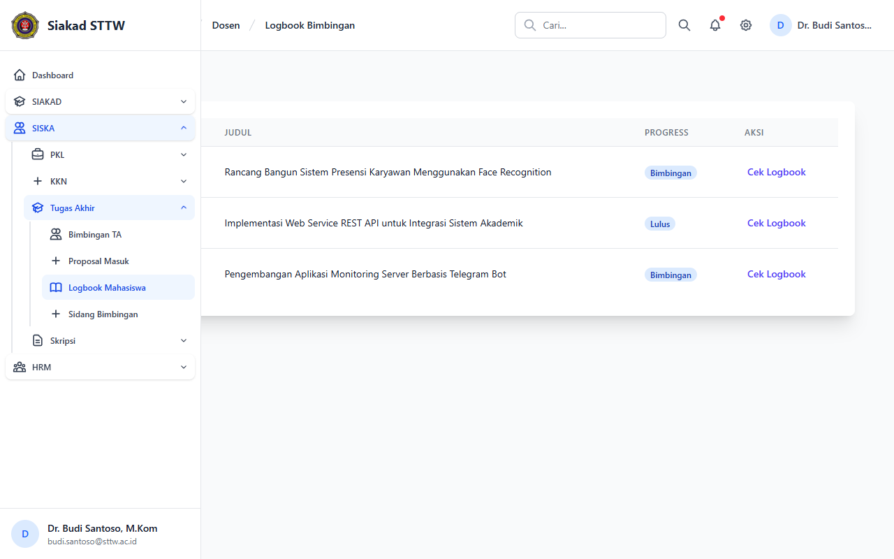
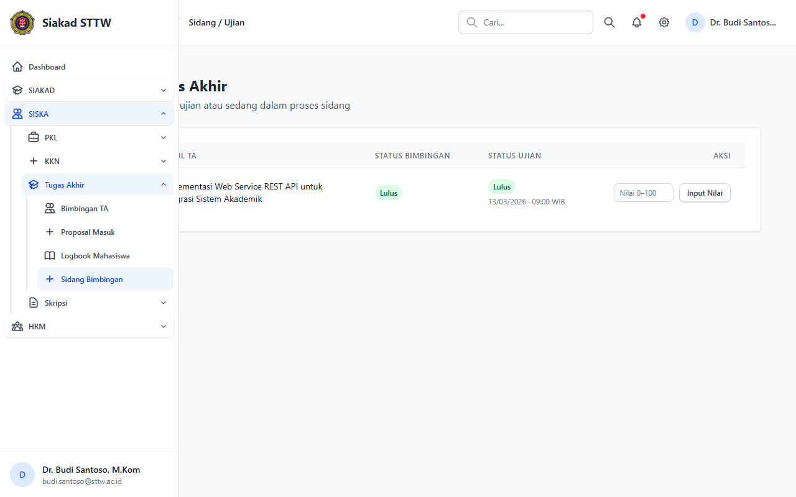
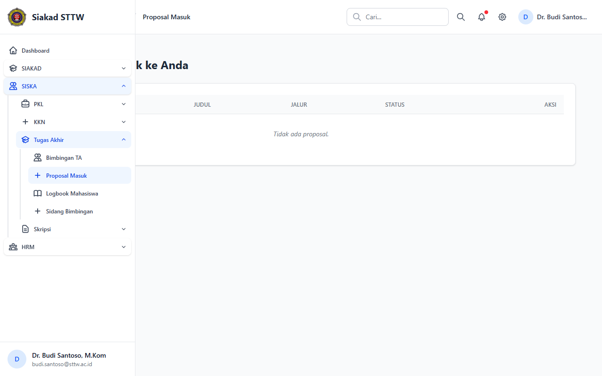

# TA — Dosen (Dr. Budi Santoso, M.Kom)

> Direkam: 2026-03-25  
> Role: **Dosen (budi.santoso@sttw.ac.id)**  
> Modul: **TA**  
> Status: ✅ Berhasil

## Ringkasan

Workflow Tugas Akhir dari sisi dosen pembimbing. Menampilkan daftar mahasiswa bimbingan, logbook bimbingan, jadwal sidang, dan proposal yang perlu ditinjau.

## Halaman

| # | Halaman | URL | Status |
|---|---------|-----|--------|
| 01 | Bimbingan TA | `/siska/ta/dosen/bimbingan` | ✅ OK |
| 02 | Logbook Bimbingan TA | `/siska/ta/dosen/logbooks` | ✅ OK |
| 03 | Sidang TA | `/siska/ta/dosen/sidangs` | ✅ OK |
| 04 | Usulan Proposal TA | `/siska/ta/dosen/proposals` | ✅ OK |

## Screenshots

### 1. Bimbingan Tugas Akhir

Daftar mahasiswa bimbingan TA.

### 2. Logbook Bimbingan TA

Catatan bimbingan mahasiswa TA.

### 3. Sidang TA — Dosen

Daftar jadwal sidang TA.

### 4. Usulan Proposal TA

Daftar proposal yang perlu ditinjau.

