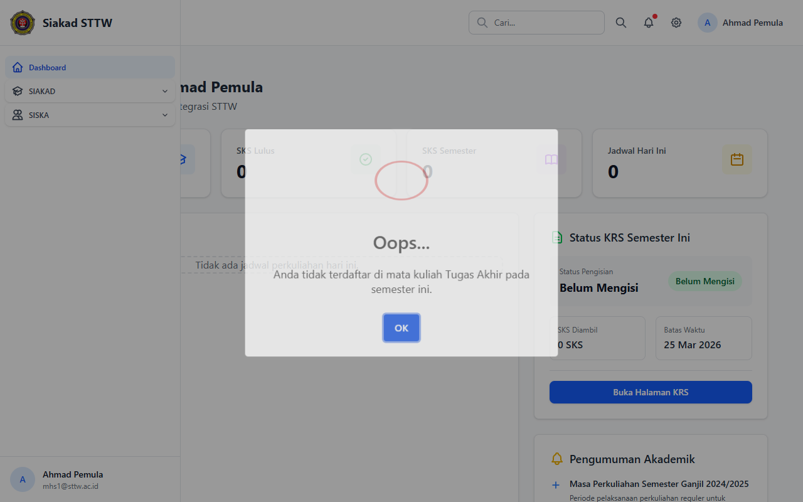

# TA — Mahasiswa (Ahmad Pemula)

> Direkam: 2026-03-25  
> Role: **Mahasiswa (mhs1@sttw.ac.id)**  
> Modul: **TA (Tugas Akhir)**  
> Status: ⚠️ Tidak Eligible

## Ringkasan

Workflow Tugas Akhir dari sisi mahasiswa. Mahasiswa tidak dapat mengakses modul TA karena belum memiliki KRS yang disetujui untuk mata kuliah TA. Middleware `EnsureSiskaEligible` mencegah akses.

## Halaman

| # | Halaman | URL | Status |
|---|---------|-----|--------|
| 01 | Cek Eligibilitas TA | `/siska/ta` | ⚠️ Tidak Eligible |

## Screenshots

### 1. Cek Eligibilitas TA

Muncul dialog eligibilitas TA yang mencegah mahasiswa mengakses fitur Tugas Akhir.

## Catatan

- Mahasiswa ini belum memiliki KRS yang disetujui untuk mata kuliah TA
- Middleware `EnsureSiskaEligible` mencegah akses
